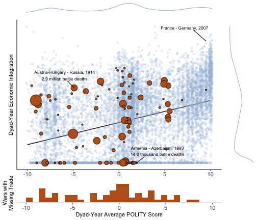

\newpage

# Introduction

Economically advanced, democratic countries trade intensely and scrupulously avoid war with one another. This "modern economic peace" [@CoeND] is empirically striking, but stubbornly resistant to theoretical consensus. One family of theories holds that this peace is "democratic" in nature [@Oneal1997; @Schultz2001; @Russett2001; @Fearon2008]. Another maintains that "commercial" ties bind countries into pacific relations [@Angell1911; @Polachek1980; @Mansfield2000a; @Gartzke2001; @Gartzke2007; @Martin2008; @Hegre2010].^[For a complete survey, see @Gartzke2015.]

The flow of trade is highly sensitive to trade policy [@Anderson2004], which is set by governments with commercial objectives that vary as a function of their political regimes [@Milner2005; @Gawande2009; @Ossa2014]. These same governments make choices over security policy, and whether or not to engage in wars with their trading partners. Political regimes affect the degree of political bias in policymaking -- the extent to which policies favor the masses or a small political elite [@BuenodeMesquita2003; @Acemoglu2005; @Jackson2007]. This makes it difficult to interpret the stylized facts of the modern economic peace. Are the advanced democracies peaceful because of their deep trading relations? Or do their political institutions generate incentives for trade and peace simultaneously?

Here, I develop a theory of trade, war, and political bias, in which both trade and war are endogenous objects. Governments choose trade policies that affect trade flows and welfare in the international economy, and vary on the extent to which are biased toward the narrow interests of firms versus the broad interests of consumers. War is employed to institute regime change abroad, altering the preferences of foreign governments and their concomitant policy choices. Trade policy bargaining is conducted "in the shadow of power" [@Powell1999], with counterfactual wars shaping the policy choices that prevail in times of peace. The model marries literatures on intra-industry trade [@Krugman1980; @Venables1987], the political economy of trade policy [@Grossman1994; @Grossman1995; @Ossa2011; @Ossa2012], and bargaining and war [@Fearon1995].

Governments care about the trade policy choices of their trading partners because of market access externalities [@Ossa2011; @Ossa2012]. By imposing barriers to  market access (tariffs), governments (partially) exclude foreign firms from the domestic market, shifting profit opportunities from foreign to home firms.^[I consider tariffs as the only trade policy instrument available to governments in the model developed below. However, in principle, barriers to trade can take on many other forms.] If governments value the profit opportunities of their own firms, then they will care about the trade policy choices of foreign governments.

Because they prefer free trade, *low bias* governments that internalize the interests of consumers impose smaller externalities on their trading partners, and present these trading partners with fewer incentives to forcibly impose regime change (Proposition `` 3 ``). This decreases the likelihood of war between low bias governments (Proposition `` 4 ``). To the extent that democracies approximate the low bias ideal, this provides an explanation for the "democratic" component of the modern economic peace. Because these low bias governments also impose smaller barriers to trade, low bias dyads also trade more than their high bias counterparts. Thus, a correlation between trade and peace emerges (spuriously) from the model (Proposition `` 5 ``).

This correlation can be seen in Figure \ref{fig:emp_wars}. Since 1870, democratic dyads have tended to be more deeply economically integrated than autocratic and mixed dyads. The also almost never fight wars with one another. The model provides an interpretation for this phenomenon, without assigning trade or conflict causal primacy. The modern economic peace emerges because democracies' trade policy *preferences* are compatible with the preferences of other democracies. This renders military power superfluous -- military coercion serves no purpose in relations between democracies. By contrast, the ideal trade policies of autocracies impose large externalities on other governments and generate incentives for coercive diplomacy.

The kind of military influence theorized here has been dubbed *gunboat diplomacy* [@Findlay2007]. The United States coerced trade policy concessions out of Japan in the 1850s through the Perry Expeditions, an instance in which its policy demands were clearly paired with a threat of military force. In the same period, Britain and France succeeded in forcing a recalcitrant Chinese government to open its markets in the Opium Wars (1839-1842; 1856-1860). In both cases, the target government held protectionist preferences and was forced to deviate from its ideal policies in order to appease a more militarily powerful adversary. The model provides a possible rationale for the relative dearth of such incidents in the post-World War II, more democratic era. Nevertheless, governments in the modern era still appear to employ overt and covert force to secure favorable commercial policy outcomes abroad [@Dube2011; @Berger2013].

In the model, governments value militaries for their ability to impose regime change. Puppet governments installed by governments victorious in wars have liberal trading preferences and allow victorious governments to secure previously unrealized market access. This is the threat point governments leverage in securing more favorable bilateral trade policy outcomes. When peaceful bargaining fails, regime change is employed instrumentally to change trade policy outcomes. This feature of the model provides a political-economic rationale for foreign-imposed regime change in world politics [@Owen2002; @Lo2008].

Latent government preferences over trade policy matter because they determine what policy each government would adopt in the absence of foreign military coercion. The need for regime change is obviated if a government will maintain completely open markets when uncoerced. Thus, two maximimally liberal (low bias) governments will find no rationale for conflict. I argue verbally that democracies are more likely to approximate the low bias ideal, due to the power their political institutions imbue in consumers (voters). I crudely embed this logic in the governments' preference structure, and provide microfoundations for this assumption in the Appendix.^[In progress.] Because consumers benefit from liberal trade policies, they should be expected to punish politicians that implement such policies [@Grossman1996; @Kono2008b].^[For skeptical takes on these mechanisms, see @Guisinger2009 and @Betz2019.] This provides a check on the (often protectionist) influence of special interest groups [@Grossman1994]. "Bias" in the model developed here is also similar conceptually to the size of the selectorate in the model of @BuenodeMesquita2003. Several studies provide evidence that democracies indeed adopt more liberal trade policies than autocracies [@Goldberg1999; @Mansfield2000b; @Milner2005; @Gawande2009; @Gawande2015].^[See @Kono2006 and  @Queralt2015 for alternative conclusions.] To the extent that this argument holds, the results derived about the behavior of low bias governments extend to those of democratic governments, providing an account of the modern economic peace. 

Because it determines policy preferences, the governments' degree of political bias also structures the bargaining environment between them. Low bias governments experience small conflicts of interest with one another, because their policy preferences are largely harmonious. By contrast, high bias governments endeavor to implement high barriers to trade, imposing large externalities on one another and generating conflicts of interest. Workhorse models of international war take this conflict as given [@Fearon1995]. These models ask: *given a conflict of interest*, what prevents governments from resolving disputes peacefully?

In abstracting away from the exact nature of the dispute at hand, these models direct our attention away from the question of why international disputes emerge in the first place. What do governments want, and why do their objectives bring them into conflict with one another [@Moravcsik1997]? In the model presented here, governments value the welfare of firms and consumers within the economy. The size of the "pie" over which governments negotiate depends on the weight they place on the welfare of consumers relative to firms. When information about the costs of war is held privately, this variation in the stakes of the negotiation affects governments' war propensity. 

The classical approach to the study of trade and war holds that economic integration increases the opportunity costs of conflict, driving states toward more pacific international relations [@Polachek1980].^[This logic has been critiqued by @Morrow1999b and @Gartzke2001.] @Pollins1989b presents an alternative interpretation of the same empirical facts -- namely, that amicable political relations promote trade. The fundamental problem is that "contentious" economies featuring both exchange and predation are not reducible to their economic and military components. Rather, military capacity influences the pattern of exchange, and expectations about exchange influence how governments choose to employ their military capacity.^[See @Carroll2018 for a unified treatment of economic exchange and military predation in a "contentious" international economy.]

Even if militaries ceased to exist, international trade would not likely be free, because governments do not always value the gains from trade. As @Gawande2009 show, many governments’ observed trade policy behavior is consistent with mercantilist preferences, in which market access abroad is valued but domestic liberalization may not be. Why, then, should these governments view conflict as inducing opportunity costs? If they are sufficiently mercantilist, trade-disrupting conflict might improve their welfare, as it decreases the amount of competition facing domestic industries. Moreover, economic integration is rarely exogenously given. Governments that maintain trade policy autonomy can always choose the extent to which they participate in the global economy. This "endogenous" component of trade costs generates substantial trade frictions, even in today’s relatively globalized era [@Anderson2004; @Cooley2018].

The model developed here overcomes these analytical challenges by simultaneously modeling political bias, trade, and international conflict. It allows for domestic political processes to affect international relations, and for international bargaining to affect domestic policy outcomes. In the parlance of international relations theory, the model employs the analytical "second image" and "second image reversed" [@Waltz1959; @Gourevitch1978].^[@Lake2009b terms this paradigm "Open Economy Politics."] Employing the second image, the literature on "two-level games" [@Putnam1988; @Milner1997] and war links variation in domestic political institutions to variation in international conflict propensity [@Lake1992; @Snyder1993; @Schultz1998; @Solingen2014]. 

Because policy choices often generate international externalities, governments seek influence over the policy choices of other governments. Here, forces from abroad influence policy choice at home -- the second image reversed. Trade itself can be used as a form of leverage, if governments' welfare depends on market access or critical resources from abroad [@Hirschman1945]. Governments might also direct trade to minimize threats to their national security [@Gowa1993]. @Antras2011 analyze the effect of international interference in domestic political processes on trade policy. In the anarchy of world politics, such influence can always -– in principle -– take the form of threats, displays, or uses of military force [@Fearon1997]. This is the kind of influence analyzed here. @Bils2017 and @Krainin2018 have also considered models of bargaining and war in which the preference structure of the bargainers is more complex than the workhorse model of @Fearon1995.

The paper proceeds as follows. I first formalize the environment in which governments operate -- the international economy and the coercive bargaining setting. I then analyze this environment, formalizing the concepts of regime change and conflicts of interest along the way. This section concludes with the core Propositions (`` 4 `` and `` 5 ``) of the paper -- which maintain that low bias dyads trade more and fight less than their high bias counterparts. The connection between these propositions and the modern economic peace are discussed in the proceeding section. A final section concludes, discussing limitations of the argument and implications for the fields of international security and international political economy.

# Environment

Here and in the Analysis section, I relegate proofs and derivations of key quantities to the Appendix, in order to ease exposition. I first present the context in which governments bargain, followed by the international economy which defines how trade policies affect prices, wages, and trade flows and the welfare of consumers, firms, and the governments that represent them. Proposition `` 1 ``, presented in this section, holds that given our assumptions, an *economic equilibrium* (Definition `` 2 ``) will exist for any trade policy choices. Lemma `` 1 `` states that within this environment, government preferences over trade policies are well-behaved and admit interior solutions.

## International Bargaining

Two governments, home ($i$) and foreign ($j$) bargain over their joint trade policies $\bm{\tau} = \left\{ \tau_i, \tau_j \right\} \in [1, \bar{\tau}]^2$.^[Here, $\bar{\tau}$ is an aribitrary prohibitively high tariff that shuts down bilateral trade.] By controlling the degree of market access afforded to foreign firms, governments' trade policies impose externalities on one another. Government utility can therefore be written $G_i( \bm{\tau} | a_i)$.^[I develop the international economy from the home country's perspective, but analagous primitives exist for the foreign country.] Government preferences depend on an exogenous parameter $a_i \in [0, \bar{a}]$, which controls the value these governments place on consumer welfare, relative to firm profits.^[Governments also value (symmetrically) the revenue raised from tariffs. I discuss this assumption in more detail in the subsection "Tariff Revenue" below.] Higher tariffs increase firm profits by shifting market share to local firms. This comes at the expense of consumers, however, who benefit from having access to a variety of products, home and foreign. Higher tariffs also harm foreign firms, and, to the extent that it internalizes their welfare, the foreign government. This is the model's core conflict of interest. Each government would like to implement some degree of protectionism at home, while maintaining access to markets abroad. 

Bargaining occurs in the shadow of power. Government 1 makes a take-it-or-leave-it offer $\tilde{\bm{\tau}}$ to Government 2, which can either accept the offer or declare war. I adopt a simple coercive bargaining framework following @Fearon1995. Here, however, war results in *regime change*, rather than a simple costly division of a fixed surplus. Regime change is modeled as a change in a vanquished government's *preferences*. If a government wins a war, it replaces the regime of its counterpart, fixing its preference parameter at $\tilde{a}_j$. $\rho$ denotes the probability that Government 1 is successful in a war for regime change.^[With complementary probability, the initiating government is overthrown. An more realistic formulation might allow for the possibility that no regime change occurs, with $\rho_i + \rho_j \leq 1$. While this "all or nothing" conception of war is stark, it simplifies the analysis and highlights the forces at play.] $c_i$ is the cost that each government must pay if a war occurs. $c_j$ is held as private information. Government 1 believes $c_j$ is distributed according to $F$ where $F$ is the uniform c.d.f.
\begin{equation} \label{eq:F}
F(c_j) = 
\begin{cases}
0 & \text{if } c_j < 0 \\
\frac{ c_j }{ \bar{c} } & \text{if } c_j \in [ 0, \bar{c} ] \\
1 & \text{if } c_j > \bar{c}
\end{cases}
\end{equation}

As is standard in bargaining models of war, the relative costs of war must be bounded, or the proposing country will never risk conflict. Assumption `` 1 `` formalizes this intuition. 

**Assumption 1:** $c_i < \kappa$ where $\kappa$ is a postive constant defined in the Appendix.

A strategy for Government $i$ is an offer, $\tilde{\bm{\tau}}(a_i)$. A strategy for Government $j$, denoted $\omega(\tilde{\bm{\tau}}(a_i) | a_j)$ is a mapping between this offer and a choice of whether or not to attempt regime change
$$
\omega : \tilde{\bm{\tau}}(a_i) \rightarrow \left\{ \text{war}, \neg \text{war} \right\}
$$
Let $\tilde{G}_i(\tilde{\bm{\tau}}(a_i), \omega(\tilde{\bm{\tau}}(a_i) | a_j) | a_i)$ denote each government's utility as a function of these choices. From these objects we can define a bargaining equilibrium. 

**Definition 1:** A *bargaining equilibrium* is pair of functions, $\tilde{\bm{\tau}}^\star(a_i)$ and $\omega^\star(\tilde{\bm{\tau}}(a_i) | a_j)$ such that
$$
\tilde{\bm{\tau}}^\star(a_i) = \argmax \tilde{G}_i \left( \tilde{\bm{\tau}}(a_i), \omega^\star(\tilde{\bm{\tau}}(a_i) | a_j) | a_i \right)
$$
and
$$
\omega^\star(\tilde{\bm{\tau}} | a_j) = \argmax \tilde{G}_j \left( \tilde{\bm{\tau}}, \omega(\tilde{\bm{\tau}} | a_j ) \right)
$$

## International Economy

Government preferences in the game described above depend on the mechanics of the international economy. To simply the presentation and focus on the dynamics of coercive bargaining in this political economy, I consider the special case in which countries are mirror images of one another in terms of their economic primitives. Each country is inhabited by a representative consumer with labor endowment $L$. Consumers value varieties of manufactured goods and goods from an undifferentiated outside sector, which I'll call agriculture. By providing their labor to local producers of these goods, they earn an endogenous wage $w_i$. A unit of labor can produce one unit of both differentiated goods and agricultural goods. There are $n$ firms in each economy which produce differentiated manufactured goods.^[In a completely general equilibrium, this quantity would also be an endogenous object. Fixing the number of firms allows each firm to derive positive profits, providing biased governments with an incentive to implement a positive tariff. In this sense, the model is in a "short run" equilibrium in which profits have not yet been competed away. I assume that $n$ is large enough such that firms take the price index $P_i$ as given when choosing prices.] Agricultural goods are produced competitively. The setup borrows from @Venables1987 and @Ossa2012. 

### Tariffs and Prices

Firms engage in monopolistic competition, setting prices in each market to maximize profits, given the preferences of consumers. Governments can shift the prices that consumers pay for foreign goods by charging a uniform import tariff on manufactured goods, $\tau_i - 1$. This drives a wedge between the price set by foreign firms, $p_j$, and the price paid by consumers for foreign goods, $p_{ij} = \tau_i p_j$. The price in the agricultural sector serves as the numeraire, $p_i^y = 1$. The government collects the revenue raised from tariffs.

### Consumption

Consumer preferences over agricultural goods $Y_i$ and aggregated differentiated varieties $X_i$ are Cobb-Douglas, where an exogenous parameter $\alpha \in [0,1]$ controls the consumers' relative preference for differentiated varieties. Consumers therefore solve the following problem
\begin{equation} \label{eq:cMax}
\begin{split}
\max_{X_i, Y_i} & \quad X_i^\alpha Y_i^{1 - \alpha} \\
\text{subject to} & \quad P_i X_i + Y_i \leq w_i L
\end{split}
\end{equation}
where $X_i$ is a CES aggregate of manufactured goods $x$, a la @Dixit1977. Consumers value each differentiated good equally. Home and foreign goods are distinguished only by their price. Let $x_{ij}$ denote the quantity of differentiated goods produced in country $j$ that are consumed in country $i$. This gives
\begin{equation} \label{eq:CES}
X_i = \left( n x_{ii}^{\frac{\sigma - 1}{\sigma}} + n x_{ij}^{\frac{\sigma - 1}{\sigma}} \right)^{\frac{\sigma}{\sigma - 1}}
\end{equation}
where $\sigma > 1$ is the elasticity of substitution between varieties. The aggregate price level of differentiated goods in each country is described by the CES exact price index
\begin{equation} \label{eq:P}
P_i = \left( n p_{ii}^{1-\sigma} + n p_{ij}^{1-\sigma} \right)^{\frac{1}{1 - \sigma}}
\end{equation}

Equilibrium demand for manufactured goods from $j$ in $i$ is
\begin{equation} \label{eq:demand}
x_{ij}^\star(p_{ij}) = p_{ij}^{-\sigma} P_i^{\sigma - 1} \alpha w_i L
\end{equation}

Indirect utility over manufactured goods is
\begin{equation} \label{eq:V}
V_i^x(P_i) = \frac{\alpha w_i L}{P_i}
\end{equation}

### Production

Firms set prices to maximize profits across home and foreign markets, given consumer demand. Because all firms in country $i$ face the same demand curves at home and abroad, they all set the same price. The quantity that each firm $i$ produces for market $j$ is equal to the demand for $i$'s goods in $j$, $x_{ij}^\star$. The firms' problem is given by
\begin{equation} \label{eq:Pi}
\begin{split}
\max_{p_i} & \quad \Pi_i(p_i) = \left( p_i - w_i \right) \left( x_{ii}^\star(p_i) + x_{ji}^\star(p_i) \right) \\
\text{subject to} & \quad x_{ii}^\star(p_i) = p_i^{-\sigma} P_i^{\sigma - 1} \alpha w_i L \\
& \quad x_{ji}^\star(p_i) = (\tau_j p_i)^{-\sigma} P_j^{\sigma - 1} \alpha w_j L
\end{split}
\end{equation}

This problem yields equilibrium prices
\begin{equation} \label{eq:prices}
p_i^\star = \frac{\sigma}{\sigma - 1} w_i
\end{equation}

Equilibrium profits can then be computed as $\Pi_i(p_i^\star)$
\begin{equation} \label{eq:PiStar}
\Pi_i(p_i^\star) = n \left( \frac{1}{\sigma - 1} w_i \right) \left( x_{ii}^\star(p_i^\star) + x_{ji}^\star(\tau_j p_i^\star) \right)
\end{equation}

By raising the price of foreign varieties, tariffs shift profits from foreign to home producers. As tariffs get large ($\tau_j \rightarrow \bar{\tau}$), demand for foreign manufactured goods contracts ($x_{ji}^\star(\tau_j p_i^\star) \rightarrow 0$). Consumers substitute toward home varieties ($p_j^\star x_{jj}^\star(p_j^\star) \rightarrow \alpha w_j L$), increasing local profits. While consumers are harmed by the imposition of tariffs ($\frac{\partial V_j}{\partial \tau_j} < 0$), local producers benefit. The preferences of home consumers are aligned with those of *foreign* firms, both of which desire liberal trade policies from the home government. 

I assume that firms' welfare is dependent only on their profits, and not influenced by the aggregate price level ($P_i$) within the economy. This is consistent with the special case of @Grossman1994 in which firm owners are "small" in the broader population. A more complex preference structure would emerge if this assumption were violated, or if firms employed intermediate goods in production.

### Economic Equilibrium

Consumers lend their labor endowment to the manufacturing and agricultural sectors in order to maximize their income. If both sectors are active, this implies wages must equalize across sectors, $w_i^x = w_i^y = w_i$. Let $L_i^x$ denote the amount of labor $i$ allocates toward manufacturing and $L_i^y$ the amount of labor $i$ allocates toward agriculture.

**Definition 2:** An *economic equilibrium* is pair of wages $\left\{w_i, w_j \right\}$ such that international agricultural and manufacturing markets clear
\begin{equation}
\begin{split}
L_i^y + L_j^y = (1 - \alpha) \left( w_i L + w_j L \right) \\
L_i^x = n \left( x_{ii}^\star(p_i^\star) + x_{ji}^\star(\tau_j p_i^\star) \right) \\
L_j^x = n \left( x_{ij}^\star(\tau_1 p_j^\star) + x_{jj}^\star(p_j^\star) \right) \\
L_i^x + L_j^x + \Pi_i(p_i^\star) + \Pi_j(p_j^\star) = \alpha \left( w_i L + w_j L \right)
\end{split}
\end{equation}
and domestic factor markets clear
\begin{equation}
\begin{split}
L_i^x + L_i^y = L \\
L_j^x + L_j^y = L
\end{split}
\end{equation}

From these equilibrium conditions, we see that profits in this framework are a transfer from consumers' labor endowment to the pockets of firms. This highlights the conflict of interest between consumers and producers within the economy. The agricultural sector pins down wages and nullifies incentives for governments to employ tariffs for purposes of manipulating the terms of trade. The following assumption guarantees that the agricultural sector will remain active regardless of the governments' choices of trade policies. Substantively, it requires that consumers spend a large enough proportion of their income on agricultural goods to prevent the specialization of either country in the production of manufactured goods.

**Assumption 2:**
$$
\alpha < \frac{2}{3} \frac{\sigma}{\sigma - 1}
$$ 

**Proposition 1:** If Assumption 2 is satisfied, then an economic equilibrium exists with $L_1^x, L_1^y, L_2^x, L_2^y > 0$ and $w_1 = w_2 = 1$ for all $\left\{ \tau_i, \tau_j \right\} \in [1, \bar{\tau}]^2$.

### Tariff Revenue

For every unit of manufactured goods imported, the government collects $(\tau_{i} - 1) p$ in tariff revenue. Unlike typical theories of optimal taxation in public economics [@Dixit1985], these revenues are not returned to the pockets of consumers. This assumption allows for a range of potential government uses for tariff revenue. Tariff revenue can in principle be devoted to any government expenditure. Low bias governments might redistribute it to the population and derive welfare from this redistribution, while high bias governments might spend it on rennovations to presidential palaces. Regardless the manner in which it is spent, governments value this revenue equally. Total tariff revenue can be written
\begin{equation} \label{eq:revenue}
r_i(\tau_i) = n (\tau_i - 1) p_j x_{ij}^\star(\tau_i p_j)
\end{equation}

### Government Preferences

Governments value a combination of consumer welfare, producer profits, and tariff revenue.^[Goverments value only the component of consumer welfare derived from the consumption of manufactured goods. With Cobb-Douglas utility and constant returns to scale technology in the agricultural sector, consumers will derive a constant utility from their consumption of agricultural goods $V_i^y$. Thus, total consumer indirect utility $V_i$ is equal to $V_i^x$ up to a constant shifter.] With these quantities derived, we can write
\begin{equation} \label{eq:G}
G_i(\tau_i, \tau_j | a_i) = a_i V_i^x(\tau_i) + \Pi_i(\tau_i, \tau_j) + r_i(\tau_i)
\end{equation}

The exogenous parameter $a_i > 0$ controls the relative weight the government places on consumer welfare, relative to profits and revenue. This conception of government preferences follows @Grossman1994, in which $a_i$ represents the value the government places on campaign contributions relative to consumer welfare. In their model, firms lobby for protective tariffs (or export subsidies), promising campaign contributions in exchange for policy deviations from the consumer welfare-maximizing ideal. @Grossman1996 provide additional microfoundations for this objective function in a model of electoral competition, in which the government can employ campaign contributions to influence the vote choice of "uneducated" voters. 

I take $a_i$ as a measure of the representativeness of $i$'s government. When $a_i$ is small (high bias), the government privileges the narrow interests of firms and its own revenue. As $a_i$ gets larger (low bias), the welfare of consumers plays a larger role in determining the governments' preferences. If democracies are more sensitive to the interests of consumers, then we would expect them to have higher values of $a_i$ than autocracies.

I focus the analysis on the interesting case in which these mixed motives cause the government to prefer some degree of protection. Assumption `` 3 `` guarantees that the government would adopt a positive tariff in a world in which coercive bargaining did not occur. This requires that the government's weight on consumer welfare be sufficiently small. Even in today's relatively open international economy, it is rare to observe governments dismantling all barriers to trade. Those governments that adopt low tariff barriers often substitute with higher non-tariff barriers to trade [@Kono2006; @Cooley2018]. For this reason, it is reasonable to assume that the preferences of governments are mercantilistic, to some extent.

**Assumption 3:** $a_i \in (0, \bar{a})$ with
$$
\bar{a} = (2n)^{\frac{1}{1-\sigma}} \left( \frac{\sigma}{\sigma - 1} + \frac{1}{2} \right)
$$

In this model, the number of firms, $n$ is given exogenously. This contrasts with standard models of international trade in which a zero profit condition disciplines the number of firms any country can support [@Krugman1980]. For this reason, $\bar{a}$ depends on $n$. As $n$ gets large, the consumer benefits from the availability of more varieties of manufactured goods -- $\bar{a}$ must fall in order to compensate for this artificial positive shock to indirect utility.

**Lemma 1:** If Assumption 3 is satisfied, then $G(\tau_i, \tau_j)$ is quasiconcave on $\tau_i \in \left[ 1, \bar{\tau} \right]$.

# Analysis

Recall from Definition `` 1 `` that a bargaining equilibrium is a trade policy offer from the home country, and a decision of whether or not to declare war, given this offer, from the foreign country. This section analyzes how these equilibrium choices vary as a function of the governments' bias types.

The results can be summarized as follows. Because they internalize the welfare of consumers, low bias governments prefer to adopt lower tariffs (Lemma `` 2 ``). If governments were unable to bargain, a non-cooperative equilibrium (Definition `` 3 ``) would emerge in which governments simply implemented their ideal tariffs. This non-cooperative equilibrium serves as a baseline from which governments compare offers in a bargaining equilibrium (Definition `` 1 ``). As governments' degree of bias increases, they impose larger and larger externalities on one another in a non-cooperative equilibrium. This increases the degree of conflict of interest between the governments (Definition `` 5 ``), and makes regime change relatively more appealing. Governments with higher bias experience larger conflicts of interest with one another (Proposition `` 3 ``) which makes them more likely to experience wars (Proposition `` 4 ``). Because they prefer lower trade barriers, low bias governments also trade more in any bargaining equilibrium (Proposition `` 5 ``). Thus, the equilibrium of the model captures the stylized facts of the modern economic peace.

## Preferences

Figure \ref{fig:G} depicts the governments' objective functions as a function of their own tariff choice, $\tau_i$. As the government becomes more representative, the peak of the curve shifts to the left, indicating that the government prefers a lower tariff. This is a natural result. As the government becomes more representative, it values the welfare of the consumer more and more. This pushes the government to adopt a policy that is closer to the consumer's ideal. 

Figure \ref{fig:iso} depicts the government's welfare in $\left\{ \tau_i, \tau_j \right\}$ space. By decreasing the market access afforded to firms in $i$, non-zero tariffs in $j$ strictly decrease the government's welfare. For any given $\tau_i$, the government's welfare is increasing as $\tau_j$ decreases.

**Lemma 2:** $G_i(\tau_j)$ is strictly decreasing in $\tau_j > 1$.

If the governments were prohibited from bargaining, they would each simply choose the policy that maximized their utility, taking the other country's policy choice as given. Their joint policies would constitute a noncooperative equilibrium.

**Definition 3:** A *noncooperative equilibrium* is a pair of policies $\left\{ \tau_i^\star(a_i), \tau_j^\star(a_j) \right\}$ such that 
$$
\tau_i^\star(a_i) = \argmax G_i(\tau_i | \tau_j^\star(a_j), a_i)
$$
and
$$
\tau_j^\star(a_j) = \argmax G_j(\tau_j | \tau_i^\star(a_i), a_j)
$$

**Lemma 3:** $\tau_i^\star(a_i)$ is decreasing in $a_i \in (0, \bar{a})$ with $\tau_i^\star(\bar{a}) = 1$.

Figure \ref{fig:br} depicts each governments' best response curves through the policy space. Because the governments' optimal choices do not depend on one another's policy choice, their best response curves are straight lines. Their intersection constitutes the noncooperative equilibrium. As the governments preferences become more biased, these curves shift outward, resulting in a more autarkic noncooperative equilibrium.

## Regime Change

It is clear that each government cares indirectly about the preferences of its bargaining partner. More welfare-concious governments adopt lower barriers to trade (Lemma 3) in a non-cooperative equilibrium, which benefits governments abroad by providing greater market access to their firms. If each government were able to choose the preferences of their negotiating partner, they would do so in order to minimize trade barriers. This is the purpose of regime change in this model. If a government wins a war, it earns the right to replace the government with a puppet with more "dovish" preferences. Regime change is therefore used instrumentally to pry open international markets. Let $a^\star \in (0, \bar{a}]$ denote the type of the optimal puppet government.

**Definition 4:** The optimal puppet's type solves
$$
\max_{a \in (0, \bar{a}]} G_i( \tau_i^\star(a_i), \tau_j^\star(a) | a_i )
$$

**Proposition 2:** $a^\star = \bar{a}$

If a government wins a war, it will replace the vanquished government with a maximimally-responsive puppet. This government will adopt no trade barriers, providing maximal market access for the victorious country's firms. This is the threat point that governments leverage in international coercive bargaining.

## Conflicts of Interest

If a government wins a war it adopts its optimal policy and enjoys complete access to the markets of its trading partner. This best case scenario yields the government utility
\begin{equation} \label{eq:Gbar}
\bar{G}_i(a_i) = G_i(\tau_i^\star(a_i), \tau_j^\star(a^\star) | a_i ) = G_i(\tau_i^\star(a_i), 1 | a_i)
\end{equation}

If a government loses a war, it is replaced by a puppet and must suffer under the policies implemented by the puppet regime. This is consistent with a notion of the government as a particular amalgamation of social actors that continues to exist at the conclusion of a war. The vanquished government yields utility
\begin{equation} \label{eq:Gubar}
\ubar{G}_i(a_i, a_j) = G_i(\tau_i^\star(a^\star), \tau_j^\star(a_j) | a_i) = G_i(1, \tau_j^\star(a_j) | a_i)
\end{equation}

These outcomes represent upper and lower utility bounds on the outcome of any coercive negotiation. Each government can be made no worse off than if it were to lose a war. And each government can secure no better bargaining outcome than if they were to (costlessly) win a war for regime change. The welfare difference between these two scenarios is taken to be $i$'s *conflict of interest* with $j$. Note that this conflict of interest, unlike standard models of bargaining and war, need not be symmetric. The "pie" at stake in the negotiation over trade policies may be valued differently by each government –- $i$’s preference intensity may be stronger than $j$’s or vice versa. This variation in preference intensity, combined with variable military power, determines bargaining outcomes.

**Definition 5:** The magnitude of government $i$'s *conflict of interest* with government $j$ is 
\begin{equation} \label{eq:Gamma}
\Gamma_i(a_i, a_j) = \bar{G}_i(a_i) - \ubar{G}_i(a_i, a_j)
\end{equation}

**Proposition 3:** $\Gamma_i(a_i, a_j)$ is decreasing in $a_i$, $a_j$

Proposition 3 states that as government $i$ becomes more welfare-concious, the magnitude of its conflict of interest decreases. Likewise, as government $j$ becomes more welfare-concious, $i$'s conflict of interest with it decreases. As government $i$ becomes more welfare-concious, it prefers less protectionism. This decreases the difference between $i$'s ideal policy and the (free trading) policy that will be imposed upon it if $j$ is victorious in a war. As $j$ becomes more welfare-concious, it imposes smaller market access externalities on $i$. Regime change becomes relatively less appealing, because the distance between $j$'s preferred policy and the policy that a puppet would impose shrinks. In the corner case where $a_i = a_j = \bar{a}$, the conflict of interest evaporates -- puppets would implement the exact same policies as the sitting governments. 

## Bargaining

These conflicts of interest structure what sets of policies $i$ will offer and what offers $j$ will prefer to war. Working backward, recall from Definition 1 that $\omega^\star(\tilde{\bm{\tau}} | a_j)$ is a function that takes an offer from $i$ and returns a choice of whether or not to declare war. $j$'s utility for war is given by
\begin{equation} \label{eq:Ghatj}
\hat{G}_j(a_j, a_i) = \underbrace{(1 - \rho) \bar{G}_j(a_j) + \rho \ubar{G}_j(a_j, a_i)}_{\zeta_j(a_j, a_i)} - c_j = (1 - \rho) \Gamma_j(a_j, a_i) + \ubar{G}_j(a_j, a_i) - c_j
\end{equation}

Note that $j$'s utility can be written in terms of it's conflict of interest with $i$. $j$ will prefer war to $i$'s offer whenever
$$
\hat{G}_j(a_j, a_i) \geq {G}_j(\tilde{\bm{\tau}} | a_j)
$$
This condition allows us to characterize $\omega^\star(\tilde{\bm{\tau}} | a_j)$.

**Lemma 4:**
$$
\omega^\star(\tilde{\bm{\tau}} | a_j) = \begin{cases}
\text{war} & \text{if } \hat{G}_j(a_j, a_i) \geq {G}_j(\tilde{\bm{\tau}} | a_j) \\
\neg \text{war} & \text{otherwise}
\end{cases}
$$

Then, with uniformly distributed costs, the probability that $j$ will declare war is
\begin{equation} \label{eq:prwar}
\begin{split}
\text{Pr} \left\{ c_j \leq \zeta_j(a_j, a_i) - G_j(\tilde{\bm{\tau}} | a_j) | \tilde{\bm{\tau}}, a_i, a_j \right\} = F \left( \zeta_j(a_j, a_i) - G_j(\tilde{\bm{\tau}} | a_j)  \right)
\end{split}
\end{equation}

With this quantity known, we can work to characterize $i$'s offer function, $\tilde{\bm{\tau}}^\star(a_i)$. If war occurs, $i$ receives utility
\begin{equation} \label{eq:Ghati}
\hat{G}_i(a_i, a_j) = \rho \Gamma_i(a_i, a_j) + \ubar{G}_i(a_i, a_j) - c_i
\end{equation}

With the probability of war given in Equation \ref{eq:prwar}, we can write $i$'s utility for any offer as
\begin{equation} \label{eq:Gtildei}
\begin{split}
\tilde{G}_i \left( \tilde{\bm{\tau}}, \omega^\star(\tilde{\bm{\tau}} | a_j) | a_i \right) = \underbrace{\left( 1 - F \left( \zeta_j(a_j, a_i) - G_j( \tilde{\bm{\tau}} | a_j ) \right) \right) \left( G_i( \tilde{\bm{\tau}} | a_i ) \right)}_{\neg \text{war}} + \\
\underbrace{F \left( \zeta_j(a_j, a_i) - G_j(\tilde{\bm{\tau}} | a_j) \right) \left( \hat{G}_i(a_i, a_j) \right)}_{\text{war}} 
\end{split}
\end{equation}

By Definition 1, $i$'s equilibrium offer will maximize this objective function. Lemmas `` 5 `` and `` 6 `` state that an offer will lie inside the pareto set and that proposed trade policies will be weakly more liberal than those in a noncooperative equilibrium (Definition 3).

**Definition 6:**  The *pareto set* is given by
$$
\mathcal{P} = \left\{ \tilde{\bm{\tau}} \in [1, \bar{\tau}]^2 | \tilde{\bm{\tau}} = \argmax \lambda G_i(\tilde{\bm{\tau}} | a_i) + (1 - \lambda) G_j(\tilde{\bm{\tau}} | a_j) \right\}
$$
for some $\lambda \in [0, 1]$.

**Lemma 5:** $\tilde{\bm{\tau}}^\star(a_i) \in \mathcal{P}$

**Lemma 6:** $\tilde{\bm{\tau}} = \left\{ \tilde{\tau}_i^\star, \tilde{\tau}_j^\star \right\} \leqslant \left\{ \tau_i^\star(a_i), \tau_j^\star(a_j) \right\}$

The bargaining enviroment is depicted in Figure \ref{fig:bar}. Government $i$'s ideal point lies in the bottom right corner of the bargaining space, in which $j$ opens its markets completely and $i$ implements $\tau_i^\star(a_i)$. Government $j$'s ideal point, conversely, lies in the top left corner. By Lemma 5, $i$'s offer will lie along the dark line connecting these ideal points. Government $i$'s utility is strictly decreasing as it moves along the pareto set toward $j$'s ideal point.^[This observation follows from Lemmas 1 and 2.] However, the closer $i$'s offer is to it's ideal point, the more likely $j$ is to declare war. Thus, government $i$ confronts a classic risk-return trade-off [@Powell1999].

Here, however, the extent to which this trade-off bites depends on the magnitude of $i$'s conflict of interest with $j$. If $i$ and $j$ are maximially welfare concious, they both adopt free trade, obviating the need for any bargaining at all. As $i$ and $j$ become more kleptocratic, the stakes of the negotiation increase. As Proposition `` 4 `` formalizes, this increases the likelihood of war.

**Proposition 4:** In any bargaining equilibrium (Definition 1), the probability of war is weakly decreasing in $a_i$ and $a_j$.

Whether or not war occurs, the policy outcomes of the bargaining equilibrium become more liberal as the governments become less biased. This increases trade between the governments.

**Proposition 5:** In any bargaining equilibrium (Definition 1), trade is weakly increasing in $a_i$ and $a_j$.

# Discussion

To summarize, Proposition 2 states that if regime change occurs, vanquished governments will be replaced by low bias types, in order to maximize market access for firms in the victorious country. Proposition 3 states that this causes larger conflicts of interest between high bias governments. Because of these larger conflicts of interest, high bias governments are also likely to fight wars more often (Proposition 4). In the end, low bias pairs trade more than high bias pairs, because of their underlying more liberal trade policy preferences (Proposition 5).

The observation that protectionism and foreign policy hostility are correlated is as old as @Gerschenkron1943. In implementing high tariffs, high bias governments cut into the profits of firms abroad, whose welfare becomes more important as the foreign government becomes more biased. This behavior both increases the returns to being able to replace foreign governments with puppets with more dovish preferences, and increases the costs of being forced to adopt the policies of a foreign-installed puppet. These counterfactual scenarios determine the magnitude of the conflict of interest governments face when interacting with one another, and the likelihood that governments will be unable to find a peaceful resolution to their conflict of interest.

The positive correlations between trade, democracy, and war propensity are the central features of the modern economic peace. While the model developed here predicts that trade and peace will be positively correlated, trade *policy* remains the object of contention between governments. Protectionist barriers cause conflicts of interest between market access-motivated governments. Consistent with this argument, @Mcdonald2004 shows that measures of *protection* are better predictors of international conflict than simple trade flows, which might remain large even in the presence of large trade barriers.^[His analysis covers the years 1960-2000.] World War I broke out during an era of rapid globalization, but @Mcdonald2007 show that the great powers maintained high protective tariffs during this era, providing a rationale for conflict over market access conditions. @Chatagnier2015 show that governments whose firms compete in the same export markets are more likely to experience international conflicts, consistent with a (yet unwritten) multi-sector version of this model. Examining a host of major conflicts in the 19th and 20th centuries, @Copeland2014 concludes that governments are more likely to fight when they have a dim view of future *trade expectations*. Of course, these trade expectations are influenced by governments' expectations of what trade policies will be adopted by governments with which they interact. Governments' bias types, a domestic political primitive dismissed by Copeland, are thus at the root of both trade expectations and conflict propensity.

While regime type (bias) influences governments' policy preferences, military power determines which government is able to maintain policies closer to its ideal. Powerful countries (high $\rho$) adopt home tariffs close to their ideal, while coercing market access out of their militarily weaker trading partner. In this sense, military power and political bias interact to determine trade policy outcomes. Governments's trade policies reflect their underlying policy preferences, up to a regime change constraint from abroad. The government's constrained choice balances domestic interests against military threats from abroad. Empirically, this suggests that militarily powerful countries should receive better market access conditions, all else equal, than their weaker counterparts.

The source of foreign policy belligerence in the model is the protectionist preferences of home firms, and the governments that internalize these preferences. @Fordham2019 traces the development of the United States as a naval power, starting in the late 19th century. He finds that protectionist economic interests were the strongest advocates for the nascent U.S. fleet. At the time, the United States pursued a policy of protectionism at home, and sought preferential market access in developing countries, particularly in Latin America. The fleet served to protect these objectives against military interference from Europe. At the dawn of the Cold War, Congressmen representing districts with export-oriented firms tended to also support the burgeoning U.S. alliance network and an aggressive military posture toward the Soviet Union [@Fordham1998]. The goal of these firms, argues Fordham, was to secure market access and a stable investment climate in Europe and Japan and protect these markets from Soviet control. While these actions were often justified in terms of ensuring U.S. security, underlying economic interests shaped what is deemed a security threat in the first place [@Fordham2008]. In the post-Cold War era, Congressmen representing import-exposed districts have tended to support hostile foreign policies toward China, whose exports (plausibly) harm their constituent firms [@Kleinberg2013]. While their opaque nature makes it difficult to assess the influence of economic interests on security policy, authoritarian regimes arguably better internalize the trade policy interests of firm owners than their democratic counterparts, due to the more limited influence of consumers on the policymaking process.^[See @Branstetter2002 for evidence on the trade policy objectives of the Communist Party of China.]

@Lake2019 argues that the degree of military competition in U.S.-China relations in the 21st century will depend on the extent to which protectionist interests in both countries come to dominate the policymaking process. If China liberalizes its political system, and the United States rejects resurgent protectionist pressures, the governments will experience less conflict. By contrast, if China remains authoritarian, its growing firms will more readily seek protection at home and preferential market access abroad, bringing the Chinese Communist Party into conflict with the United States government.

# Conclusion

The model envisions a stylized world -- two governments preside over identical economies with military capacity and political bias types given exogenously. If the countries were heterogeneous in market size ($L_i$), the economically larger country would be conferred with an additional source of bargaining power. Whether or not this outside option "binds" in determining bargaining outcomes would depend on the relative distribution of economic and military might. Military power ($\rho$) is also treated exogenously here, but certainly would depend on economic and political primitives in any model that allowed for military investment. Because they have more at stake in international trade policy negotiations, high bias governments would be expected to invest more in their militaries, particularly if the costs of militarization are borne by consumers [@Jackson2007; @Chapman2015]. This might explain why democracies spend less on their militaries than autocracies [@Fordham2005]. In an $N$-government world, alliances would be easier to sustain between low bias governments, because these governments would experience small conflicts of interest with one another. Pooled military power could therefore be freed up to mitigate the autarkic impulses of higher bias governments. Finally, in any dynamic variant of the model presented here, regime type itself would be an endogenous object. Wars would always result in the imposition of puppet governments more welfare-concious than the vanquished governments that preceded them. This would create a natural trend toward democratization, emanating from the preferences of imperial powers [@Mcdonald2015].^[The history of imperialism suggests that conquering governments often find it easier to install highly autocratic puppets that nevertheless protect the interests of the patron government. Viewed from the lens of this theoretical framework, this behavior would stem from a desire to protect preferential access to conquered markets, a favoritist trade policy that would not be preferred by a low bias puppet.]

The model has implications for empirical international political economy scholars studying the relationship between democracy and trade liberalization. Several studies have employed the Grossman-Helpman model to structurally estimate governments' welfare-consciousness cross-nationally [@Goldberg1999; @Mitra2006; @Gawande2009; @Gawande2012; @Gawande2015]. All use as estimating equations the predicted equilibrium protection of a small country taking an international price as given [@Grossman1994] or a large country engaged in efficient 'trade talks' [@Grossman1995]. If governments set trade policy under the shadow of militarized coercion, these estimates will be biased. This estimation procedure rationalizes low levels of protection by infering that governments must place a relatively high weight on the welfare of their consumers. In this model, governments can adopt low levels of protection either because they are not rent seekers *or* because they face a credible threat of force from a trading partner that seeks market access. High bias governments whose markets are pried open by threats of force adopt the same trade policies as low bias governments which adopt such policies because they benefit consumers.

My conclusions about the theoretical basis for the empirical behavior of democratic dyads depends crucially on the mapping between low bias types in the model and real world democracies. While canonical models of trade policy formation reserve a central role for voters as a check on the protectionist impulses of firms [@Mayer1984; @Grossman1994], more recent work has cast doubts on the veracity of this assumption [@Guisinger2009; @Betz2019]. Perhaps democracies simply allow a wider variety of firms to access the political process, who in turn lobby to reduce barriers on intermediate inputs [@Kim2017]. By some measures, democracies do implement lower barriers to trade than their autocratic counterparts [@Milner2005; @Gawande2009], but this model suggests that this simple revealed preference approach to characterizing preferences is insufficient in a world in which militarized bargaining occurs. The model can only rationalize the "democratic" component of the modern economic peace if democracies indeed hold more liberal trade policy preferences than autocracies. Without this preference distribution, the modern economic peace remains an enigma from the perspective of this model.

Finally, the theory highlights a prerequisite for international conflict that is underappreciated in the existing literature. For governments to initiate war with one another, they must both 1) possess conflicts of interest large enough to justify the costs of conflict and 2) be unable to resolve these conflicts peacefully. Theoretical research on international conflict has focused principally on identifying conditions under which 2) does not obtain. But understanding the emergence of conflicts of interest is arguably as or more important than understanding bargaining failures for identifying what types of governments are most likely to experience hostile international relations. Interstate war is incredibly rare in contemporary international politics, but many dyads still experience antagonistic and militarized political relations. Focusing attention on the conflicts of interest underlying these antagonisms, rather than realized conflict, might help explain their emergence and termination.

\clearpage

# Appendix

## International Economy

**Demand for Manufactured Goods:** Total expenditure on manufactured goods is $\alpha w_i L = P_i X_i$. Cobb Douglas preferences ensure that consumers will spend an $\alpha$-share of their income on manufactured goods. We can derive Equation \ref{eq:demand} by solving Equation \ref{eq:CES} subject to the constraint
\begin{equation} \label{eq:CESconstraint}
p_{i1} x_{i1} + p_{i2} x_{i2} \leq \alpha w_i L
\end{equation} 
This gives
$$
x_{i1} = \left( \frac{p_{i2}}{p_{i1}} \right)^{\sigma} x_{i2}
$$
Substituting back into \ref{eq:CESconstraint} gives
\begin{align*}
n p_{i1} \left( \frac{p_{i2}}{p_{i1}} \right)^{\sigma} x_{i2} + n p_{i2} x_{i2} &= \alpha w_i L \\
n p{i1}^{1-\sigma} p_{i2}^{\sigma} x_{i2} + n p_{i2} x_{i2} & = \alpha w_i L \\
x_{i2} p_{i2}^{\sigma} \left( n p_{i1}^{1-\sigma} + n p_{i2}^{1-\sigma} \right) &= \alpha w_i L \\
x_{i2} p_{i2}^{\sigma} P_i^{1 - \sigma} &= \alpha w_i L \\
x_{i2}^\star(p_{i2}) &= p_{i2}^{-\sigma} P_i^{\sigma - 1} \alpha w_i L
\end{align*}
An equivalent demand condition can be derived for $x_{i1}^\star(p_{i1})$.

**Indirect Utility:** Indirect utility over manfactured good is $X_i$ evaluated at equilibrium consumption. Substituting our demand equations \ref{eq:demand} into Equation \ref{eq:CES} gives
\begin{align*}
V_i^x(P_i) = X_i^\star &= \left( n \left( p_{i1}^{-\sigma} P_i^{\sigma - 1} \alpha w_i L \right)^{\frac{\sigma - 1}{\sigma}} + n \left( p_{i2}^{-\sigma} P_i^{\sigma - 1} \alpha w_i L \right)^{\frac{\sigma - 1}{\sigma}} \right)^{\frac{\sigma}{\sigma - 1}} \\
&= \left( \left( \alpha w_i L P_i^{\sigma - 1} \right)^{\frac{\sigma - 1}{\sigma}} \left( n \left( p_{i1}^{-\sigma} \right)^{\frac{\sigma - 1}{\sigma}} + n \left( p_{i2}^{-\sigma} \right)^{\frac{\sigma - 1}{\sigma}} \right) \right)^{\frac{\sigma}{\sigma - 1}} \\
&= \alpha w_i L P_i^{\sigma - 1} \left( n p_{i1}^{1 - \sigma} + n p_{i2}^{1 - \sigma} \right)^{\frac{\sigma} \sigma - 1} \\
&= \alpha w_i L P_i^{\sigma - 1} P_i^{-\sigma} \\
&= \frac{\alpha w_i L}{P_i}
\end{align*}
Note that expenditure on manufactured goods can now be written in terms of the price index. $\alpha w_i L = P_i X_i^\star$. 

**Prices:** The firms' first order condition is
$$
\frac{\partial \Pi(p_i)}{\partial p_i} = \left( p_i - w_i \right) \left( \frac{\partial x_{ii}(p_i)}{\partial p_i} + \frac{\partial x_{ji}(p_i)}{\partial p_i} \right) + x_{ii}(p_i) + x_{ji}(p_i) = 0
$$
where
$$
\frac{\partial x_{ii}(p_i)}{\partial p_i} = - \sigma p_i^{- \sigma - 1} P_i^{\sigma - 1} \alpha w_i L
$$
and
$$
\frac{\partial x_{ji}(p_i)}{\partial p_i} = - \sigma \tau_j^{-\sigma} p_i^{- \sigma - 1} P_j^{\sigma - 1} \alpha w_j L
$$
Note that 
$$
- \frac{\sigma}{p_i} \left( x_{ii}(p_i) + x_{ji}(p_i) \right) = \frac{\partial x_{ii}(p_i)}{\partial p_i} + \frac{\partial x_{ji}(p_i)}{\partial p_i}
$$
The first order condition then becomes
\begin{align*}
\sigma \frac{w_i}{p_i} \left( x_{ii}(p_i) + x_{ji}(p_i) \right) - \sigma \left( x_{ii}(p_i) + x_{ji}(p_i) \right) + \left( x_{ii}(p_i) + x_{ji}(p_i) \right) &= 0 \\
\sigma \frac{w_i}{p_i} - \sigma + 1 &= 0 \\
p_i^\star &= \frac{\sigma}{\sigma - 1} w_i
\end{align*}

## Proofs

**Proposition 1:** Let $q_i^y$ denote the quantity of the agricultural good produced in country $i$. A competitive agricultural sector guarantees that agricultural producers make zero profits. This zero profit condition implies
\begin{align*}
\left( p_i^y - w_i \right) q_i^y &= 0 \\
\left( 1 - w_i \right) q_i^y &= 0
\end{align*}
which implies $w_i = 1$ whenever the agricultural sector is active, $q_i^y > 0$. From Equation \ref{eq:prices}, this implies $p_i = p_j = p = \frac{\sigma}{\sigma - 1}$. Suppose for now that the agricultural sector is active in both countries, implying wages are equalized across countries and sectors. Below, we verify that this is the case if Assumption 2 is satisfied. 

Labor allocations to each sector depend on tariff levels. The labor allocation in country $i$ to sector $k \in \left\{ x, y \right\}$ can then be written $L_i^k(\tau_i, \tau_j)$. Total allocation to the manufacturing sector can be written
$$
L_i^x(\tau_i, \tau_j) = n \left( x_{ii}^\star(\tau_i) + x_{ji}^\star(\tau_j) \right)
$$
Because $x_{ii}^\star(\tau_i)$ is increasing in $\tau_i$ and $x_{ji}^\star(\tau_j)$ is decreasing in $\tau_j$, $L_i^x(\tau_i, \tau_j)$ is increasing in $\tau_i$ and decreasing in $\tau_j$. This implies $L_i^x(\tau_i, \tau_j)$ attains its maximum at $\left\{ \bar{\tau}, 1 \right\}$
\begin{align*}
L_i^x(\bar{\tau}, 1) &= n \left( p^{-\sigma} P_i(\bar{\tau})^{\sigma - 1} \alpha L + p^{-\sigma} P_j(1)^{\sigma - 1} \alpha L \right) \\
&= n \left( \frac{p^{-\sigma} \alpha L}{n p^{1 - \sigma}} + \frac{p^{-\sigma} \alpha L}{2 n p^{1 - \sigma}} \right) \\
&= \left( \frac{\alpha L}{p} + \frac{1}{2} \frac{\alpha L}{p} \right) \\
&= \frac{3}{2} \frac{\sigma - 1}{\sigma} \alpha L
\end{align*}
Allocation to the agricultural sector is then, by the labor market clearing condition, 
$$
L_i^y(\bar{\tau}, 1) = L - L_i^x((\bar{\tau}, 1))
$$
If $\alpha < \frac{2}{3} \frac{\sigma}{\sigma - 1}$, then $L_i^y(\bar{\tau}, 1) > 0$. Because total labor allocation to the manufacturing sector achieves its maximum at $\left\{ \bar{\tau}, 1 \right\}$, $L_i^y(\tau_i, \tau_j) > 0$ for all $\left\{ \tau_i, \tau_j \right\} \in [1, \bar{\tau}]^2$. $\blacksquare$

**Lemma 1:** For $G_i(\tau_i)$ to be quasiconcave, its first derivative must have a single root with 
$$
\frac{\partial G_i(\tau_i, \tau_j)}{\partial \tau_i}(1) > 0
$$
and
$$
\lim_{\tau_i \rightarrow \infty} \frac{\partial G_i(\tau_i, \tau_j)}{\partial \tau_i} < 0
$$
Note that given symmetry across countries, price indices can be written 
$$
P_i(\tau_i) = \left( n p^{1 - \sigma} + n (\tau_i p)^{1 - \sigma} \right)^{\frac{1}{1 - \sigma}} = p n^{\frac{1}{1 - \sigma}} \left( 1 + \tau_i^{1 - \sigma} \right)^{\frac{1}{1 - \sigma}}
$$
$G_i(\tau_i, \tau_j)$ can be simplified as follows
\begin{align*}
G_i(\tau_i, \tau_j) &= a_i V_i^x(\tau_i) + \Pi_i(\tau_i, \tau_j) + r(\tau_i) \\
&= a_i \frac{\alpha L}{P_i(\tau_i)} + n (p - 1) \left( x_{ii}^\star(p) + x_{ji}^\star(\tau_j p) \right) + n p (\tau_i - 1) x_{ij}^\star(\tau_i p) \\
&= \alpha L \left[ \frac{a_i}{P_i(\tau_i)} + n p^{1 - \sigma} P_i(\tau_i)^{\sigma - 1} - n p^{-\sigma} P_i(\tau_i)^{\sigma - 1} + n p^{1 - \sigma} P_j(\tau_j)^{\sigma - 1} - n p^{-\sigma} P_j(\tau_j)^{\sigma - 1} + \right. \\
& \bigl. n (\tau_i p)^{1 - \sigma} P_i(\tau_i)^{\sigma - 1} - n \tau_i^{-\sigma} p^{1 - \sigma} P_i(\tau_i)^{\sigma - 1} \biggr] \\
&= \alpha L \left[ \frac{a_i}{P_i(\tau_i)} + n ( p^{1 - \sigma} - p^{-\sigma} ) P_j(\tau_j)^{\sigma - 1} + n ( p^{1 - \sigma} - p^{- \sigma} ) P_i(\tau_i)^{\sigma - 1} \left( 1 + \tau_i^{1 - \sigma} - \tau_i^{-\sigma} \right) \right] \\
&= \alpha L \left[ a_i n^{\frac{1}{\sigma - 1}} p^{-1} \left( 1 + \tau_i^{1 - \sigma} \right)^{\frac{1}{\sigma - 1}} + ( 1 - p^{-1} ) \left( 1 + \tau_j^{1 - \sigma} \right)^{-1} + \right. \\
& \bigl. \left( 1 + \tau_i^{1 - \sigma} \right)^{-1} \left( 1 - p^{-1} + \tau_i^{1 - \sigma}  - \tau_i^{-\sigma} \right) \biggr] \\
&= \alpha L \left[ a_i n^{\frac{1}{\sigma - 1}} p^{-1} \left( 1 + \tau_i^{1 - \sigma} \right)^{\frac{1}{\sigma - 1}} + ( 1 - p^{-1} ) \left( 1 + \tau_j^{1 - \sigma} \right)^{-1} + 1 - ( \tau_i^{-\sigma} + p^{-1} ) \left( 1 + \tau_i^{1 - \sigma} \right)^{-1} \right]
\end{align*}

The first derivative is then
\begin{equation*}
\begin{split}
\frac{\partial G_i(\tau_i, \tau_j)}{\partial \tau_i} = \alpha L \left[ - a_i p^{-1} n^{\frac{1}{\sigma - 1}} \left( 1 + \tau_i^{1 - \sigma} \right)^{\frac{1}{\sigma - 1} - 1} \tau_i^{-\sigma} + \sigma \tau_i^{-\sigma - 1} \left( 1 + \tau_i^{1 - \sigma} \right)^{-1} + \right. \\
\left. \left( 1 + \tau_i^{1 - \sigma} \right)^{-2} \tau_i^{-\sigma} (1 - \sigma) ( \tau_i^{-\sigma} + p^{-1} ) \right]
\end{split}
\end{equation*}

At any root, we must have
\begin{align*}
0 &= \frac{\partial G_i(\tau_i, \tau_j)}{\partial \tau_i}  \\
&= \alpha L \left[ - a_i p^{-1} n^{\frac{1}{\sigma - 1}} \left( 1 + \tau_i^{1 - \sigma} \right)^{\frac{1}{\sigma - 1} - 1} \tau_i^{-\sigma} + \sigma \tau_i^{-\sigma - 1} \left( 1 + \tau_i^{1 - \sigma} \right)^{-1} + \right. \\
& \bigl. \left( 1 + \tau_i^{1 - \sigma} \right)^{-2} \tau_i^{-\sigma} (1 - \sigma) ( \tau_i^{-\sigma} + p^{-1} ) \biggr] \\
&= \alpha L \left[ - a_i p^{-1} n^{\frac{1}{\sigma - 1}} \left( 1 + \tau_i^{1 - \sigma} \right)^{\frac{1}{\sigma - 1}} + \sigma \tau_i^{- 1} + \left( 1 + \tau_i^{1 - \sigma} \right)^{-1} (1 - \sigma) ( \tau_i^{-\sigma} + p^{-1} ) \right]
\end{align*}

From this condition it is straightforward to verify that if $a_i < \bar{a}$, then as $\tau_i \rightarrow 1$,
$$
\frac{\partial G_i(\tau_i, \tau_j)}{\partial \tau_i} \rightarrow - a_i p^{-1} (2n)^{\frac{1}{\sigma - 1}} + \sigma + \frac{1}{2} (1 - \sigma) (1 + p^{-1}) > 0
$$
As $\tau_i \rightarrow \infty$, 
$$
\frac{\partial G_i(\tau_i, \tau_j)}{\partial \tau_i} \rightarrow - a_i n^{\frac{1}{\sigma - 1}} p^{-1} + (1 - \sigma) p^{-1} < 0
$$
Since $\frac{\partial G_i(\tau_i, \tau_j)}{\partial \tau_i}$ is a continuous function, it must therefore have at least one root, by the intermediate value theorem. To see that this root is unique, note that the first order condition can be rearranged as follows
$$
\underbrace{a_i n^{\frac{1}{\sigma - 1}} p^{-1} \tau_i}_{\phi(\tau_i; a_i)} = \underbrace{\left( \sigma + \tau_i^{1 - \sigma} + \tau_i p^{-1} ( 1 - \sigma) \right) \left( 1 + \tau_i^{1-\sigma} \right)^{\frac{\sigma}{1 - \sigma}}}_{\psi(\tau_i)}
$$
Note that $\phi(1; a_i) < \psi(1)$ for all $a_i < \bar{a}$. Additionally, $\phi(\tau_i; a_i)$ is a linear function and $\psi(\tau_i)$ is a concave function with
$$
\lim_{\tau_i \rightarrow \infty} \psi(\tau_i) = \sigma
$$
Together these facts imply that the intersection $\frac{\partial G_i(\tau_i, \tau_j)}{\partial \tau_i} = 0$ is unique. $\blacksquare$

**Lemma 2:** It is sufficient to show that 
$$
\frac{\partial G_i(\tau_j)}{\partial \tau_{j}} < 0
$$
Here we have
\begin{align*}
\frac{ \partial G_i(\tau_j) }{ \partial \tau_j } &= n (p - 1) \frac{ \partial x_{ji}^\star(p \tau_j) }{ \partial \tau_j } \\
&= \tau_j^{-\sigma - 1} \left( 1 + \tau_j^{1 - \sigma} \right)^{-1} \left( \frac{\sigma - 1}{\sigma} \right) \alpha L \underbrace{\left( \frac{\sigma - 1}{\tau_j^{\sigma - 1} + 1} - \sigma \right)}_{<0}
\end{align*}

**Lemma 3:** Government $i$'s optimal policy does not depend on the policy choice of $j$. As such, it is sufficient to show that the government's objective function has a negative cross partial with respect to $\tau_i$, $a_i$,
$$
\frac{\partial^2 G_i}{\partial a_i \partial \tau_{ij}} < 0
$$
Here we have
\begin{align*}
\frac{\partial^2 G_i}{\partial a_i \partial \tau_{ij}} &= - \frac{\sigma - 1}{\sigma} n^{\frac{1}{\sigma - 1}} \left( 1 + \tau_i^{1 - \sigma} \right)^{\frac{1}{\sigma - 1} - 1} \tau_i^{- \sigma} \alpha L
\end{align*}
To see that $\tau_i^\star(\bar{a}) = 1$, we can show that the first order condition evaluated at $\tau_i = 1$ equals zero when $a_i = \bar{a}$. From above, the first order condition evaluated at $\tau_i = 1$ is
$$
0 = - a_i p^{-1} (2n)^{\frac{1}{\sigma - 1}} + \sigma + \frac{1}{2} (1 - \sigma) (1 + p^{-1})
$$
Substituting $\bar{a}$ confirms that $\tau_i^\star(\bar{a}) = 1$. $\blacksquare$

**Proposition 2:** Follows immediately from Lemma 2 and Lemma 3 $\blacksquare$

**Proposition 3:** To establish that $\Gamma_i(a_i, a_j)$ is decreasing in $a_i$, note that derivative of $\Gamma_i(a_i, a_j)$ taken with respect to $a_i$ is
\begin{align*}
\frac{\partial \Gamma_i(a_i, a_j)}{\partial a_i} &= \left. \frac{\partial G_i(\tau_i^\star(a_i), 1 | a_i)}{\partial a_i} \right|_{\left\{ \tau_i^\star(a_i), 1 \right\}} + \underbrace{\frac{\partial G_i(\tau_i^\star(a_i), 1 | a_i)}{\partial \tau_i^\star(a_i)}}_{=0} \frac{\partial \tau_i^\star(a_i)}{\partial a_i} - \left. \frac{\partial G_i(1, \tau_j^\star(a_j) | a_i)}{\partial a_i} \right|_{\left\{ 1, \tau_j^\star(a_j) \right\}} \\
&= \underbrace{V_i^x(P_i(\tau_i^\star(a_i))) - V_i^x(P_i(1))}_{<0}
\end{align*}
where the final inequality holds because $\tau_i^\star(a_i) > 1$ for all $a_i < \bar{a}$. To see that $\Gamma_i(a_i, a_j)$ is decreasing in $a_j$, note
\begin{align*}
\frac{\partial \Gamma_i(a_i, a_j)}{\partial a_j} &= - \underbrace{\frac{\partial G_i(1, \tau_j^\star(a_j) | a_i)}{\partial \tau_j^\star(a_j)}}_{<0} \underbrace{\frac{\partial \tau_j^\star(a_j)}{\partial a_j}}_{<0}
\end{align*}
where the inequalities follow from Lemma 2 and Lemma 3. $\blacksquare$

**Lemma 5:** Obvious. $\blacksquare$

**Lemma 6:** Suppose, for sake of contradiction, that for some $\tilde{\bm{\tau}}^\star$, $\tilde{\tau}_i^\star > \tau_i^\star(a_i)$. By Lemma 5, $\tilde{\bm{\tau}}^\star$ must lie in the pareto set. By the definition of $\tau_i^\star(a_i)$, $G_i(\tilde{\tau}_i^\star, \cdot | a_i) < G_i(\tau_i^\star(a_i), \cdot | a_i)$. By Lemma 2, $G_j(\cdot, \tilde{\tau}_i^\star | a_j) < G_j(\cdot, \tau_i^\star(a_i) | a_i)$. Thus, a pareto improvement exists, contradicting the hypothesis that $\tilde{\bm{\tau}}^\star$ is an equilibrium offer. $\blacksquare$

**Proposition 4:** At this point I invoke Assumption 1, so I define the upper bound on $c_i$.
\begin{equation} \label{eq:kappa}
\kappa = \min_{\tau_i \in \mathcal{P}_i} - \bar{c} \left( 1 - F \left( \zeta_j(0, 0) - G_j(\cdot, \tilde{\tau}_i | 0) \right) \right) \frac{ \frac{\partial G_i(\tau_i, \cdot | 0)}{\partial \tau_i} }{ \frac{\partial G_j(\cdot, \tau_i | 0)}{\partial \tau_i} }
\end{equation}

Because $\frac{\partial G_j(\cdot, \tau_i | 0)}{\partial \tau_i}$ is negative, $\kappa > 0$. 

The proof proceeds through a series of lemmas. Let $\hat{\bm{\tau}}$ solve 
$$
G_i(\hat{\bm{\tau}}) = \zeta_i(a_i, a_j) = \rho \bar{G}_i(a_i) + (1 - \rho) \ubar{G}_i(a_i, a_j)
$$
subject to $\hat{\bm{\tau}} \in \mathcal{P}$. If no feasible solution exists, then let $\hat{\bm{\tau}} = \left\{ 1, \tau_j^\star(a_j) \right\}$. Note that for all $\tau_i \in \mathcal{P}$, 
$$
\frac{\partial G_i(\tilde{\tau}_i)}{\partial \tau_i} > 0
$$

**Lemma P4A:** $\hat{\tau}_i < \tilde{\tau}_i^\star$

**Proof:** From the first order condition of Equation \ref{eq:Gtildei}, we have
$$
\frac{\partial \tilde{G}_i(\tilde{\tau}_i)}{\partial \tilde{\tau}_i} = \left( 1 - F \left( \zeta_j(a_j, a_i) - G_j(\cdot, \tilde{\tau}_i | a_j) \right) \right) \frac{\partial G_i(\tilde{\tau}_i)}{\partial \tau_i} + \frac{1}{\bar{c}} \frac{\partial G_j(\tilde{\tau}_i)}{\partial \tilde{\tau}_i} \left( G_i(\tilde{\tau}_i) - \hat{G}_i(a_i, a_j) \right) = 0
$$
Rearranging,
\begin{align*}
\left( 1 - F \left( \zeta_j(a_j, a_i) - G_j(\cdot, \tilde{\tau}_i | a_j) \right) \right) \frac{\partial G_i(\tilde{\tau}_i)}{\partial \tau_i} &= \frac{1}{\bar{c}} \frac{\partial G_j(\tilde{\tau}_i)}{\partial \tilde{\tau}_i} \left( \hat{G}_i(a_i, a_j) - G_i(\tilde{\tau}_i) \right) \\
\left( 1 - F \left( \zeta_j(a_j, a_i) - G_j(\cdot, \tilde{\tau}_i | a_j) \right) \right) \frac{\partial G_i(\tilde{\tau}_i)}{\partial \tau_i} &= \frac{1}{\bar{c}} \frac{\partial G_j(\tilde{\tau}_i)}{\partial \tilde{\tau}_i} \left( \zeta_i(a_i, a_j) - c_i - G_i(\tilde{\tau}_i) \right) \\
\left( 1 - F \left( \zeta_j(a_j, a_i) - G_j(\cdot, \tilde{\tau}_i | a_j) \right) \right) \frac{\partial G_i(\tilde{\tau}_i)}{\partial \tau_i} + \frac{c_i}{\bar{c}} \frac{\partial G_j(\tilde{\tau}_i)}{\partial \tilde{\tau}_i} &= \frac{1}{\bar{c}} \frac{\partial G_j(\tilde{\tau}_i)}{\partial \tilde{\tau}_i} \left( \zeta_i(a_i, a_j) - G_i(\tilde{\tau}_i) \right)
\end{align*}

If Assumption 1 is satisfied, then the left-hand side of this equation is negative. Then, for this equality to hold, we must have
$$
\zeta_i(a_i, a_j) - G_i(\tilde{\tau}_i) < 0 \implies G_i(\tilde{\tau}_i) > \zeta_i(a_i, a_j) = G_i(\hat{\tau}_i)
$$
which in turn implies the Lemma. $\blacksquare$

**Lemma P4B:** $\tilde{\tau}_i^\star(a_i)$ is decreasing in $a_i$ and $\tilde{\tau}_j^\star(a_i)$ is increasing in $a_i$.

**Proof:** It is sufficient to show that $\tilde{G}_i(\tilde{\tau}_i)$ has negative cross partial in $a_i$. 
$$
\frac{\partial^2 \tilde{G}_i(\tilde{\tau}_i)}{\partial \tilde{\tau}_i \partial a_i} < 0
$$
From the characteristics of the Pareto set, it is immediate that if $\tilde{\tau}_i^\star(a_i)$ is decreasing in $a_i$, then $\tilde{\tau}_j^\star(a_i)$ is increasing in $\tau_i$, $a_i$. We have
\begin{align*}
\frac{\partial^2 \tilde{G}_i(\tilde{\tau}_i)}{\partial \tilde{\tau}_i \partial a_i} &= \left( 1 - F(\cdot) \right) \underbrace{\frac{\partial^2 G_i(\tilde{\tau}_i)}{\partial \tilde{\tau}_i \partial a_i}}_{<0} - \frac{1}{\bar{c}} \underbrace{\frac{\partial \hat{G}_j(a_j, a_i)}{\partial a_i}}_{>0} \underbrace{\frac{\partial G_i(\tilde{\tau}_i)}{\partial \tilde{\tau}_i}}_{>0} + \frac{1}{\bar{c}} \underbrace{\frac{\partial G_j(\tilde{\tau}_i)}{\partial \tilde{\tau}_i}}_{<0} \underbrace{\left( \frac{\partial G_i(\tilde{\tau}_i)}{\partial a_i} - \frac{\partial \hat{G}_i(a_i, a_j)}{\partial a_i} \right)}_{=\phi(\tilde{\tau}_i)}
\end{align*}
where
$$
\phi(\tilde{\tau}_i) = V_i^x(\tilde{\tau}_i) - \underbrace{\left( \rho V_i^x(\tau_i^\star(a_i)) + (1 - \rho) V_i^x(1) \right)}_{=V(\hat{\tau}_i)}
$$
Because $V_i^x$ is a decreasing function of $\tau_i$ and $\hat{\tau}_i < \tilde{\tau}_i^\star$, $\phi(\tilde{\tau}_i) < 0$, confirming that $\tilde{G}_i(\tilde{\tau}_i)$ has negative cross partial in $\tau_i$, $a_i$. This confirms $\tilde{\tau}_i^\star(a_i)$ is weakly decreasing in $a_i$. By the definition of the pareto set, we must have $\tilde{\tau}_j^\star(a_i)$ is weakly increasing in $a_i$. $\blacksquare$

The equilibrium probability of war is
$$
F \left( \zeta_j(a_j, a_i) - G_j(\tilde{\tau}_j^\star(a_i), \tilde{\tau}_i^\star(a_i)| a_j) \right)
$$
Because $G_j$ is increasing in $\tau_j \in \mathcal{P}_j$, $\tau_j^\star(a_i)$ is increasing in $a_i$, and $F(\cdot)$ is an increasing function, the probability of war is decreasing in $a_i$. A similar proof confirms that the equilibrium probability of war is decreasing in $a_j$. $\blacksquare$

**Proposition 5:** Equilibrium trade in manufactured goods is 
$$
x_{ij}^\star(\tau_i) + x_{ji}^\star(\tau_j)
$$
where both $x_{ij}^\star(\tau_i)$ and $x_{ji}^\star(\tau_j)$ are decreasing in each country's tariff rate. The bounds of the pareto set are decreasing in $a_i$, $a_j$ by Lemma 3. Otherwise, the strategic situation is unchanged from that analyzed in the proof of Proposition 4. Thus, $\tilde{\tau}_i^\star(a_i)$ and $\tilde{\tau}_j^\star(a_i)$ are weakly decreasing in $a_i$. Thus, equilibrium trade is also increasing. $\blacksquare$

\clearpage

# References

