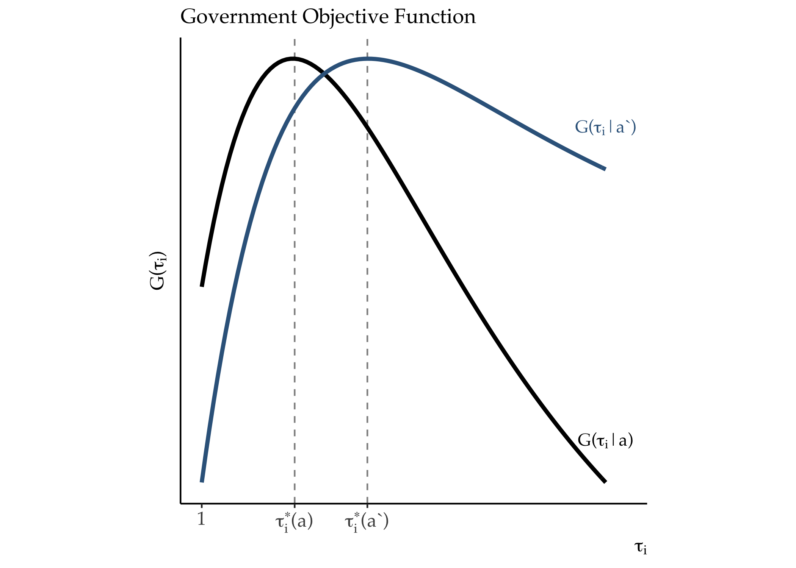
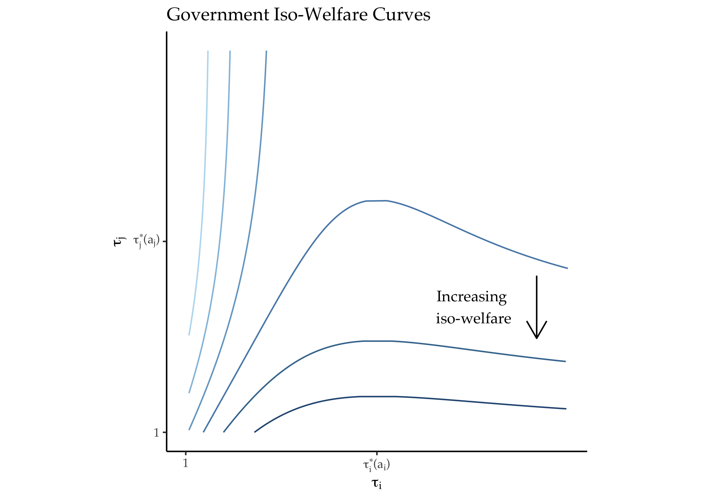
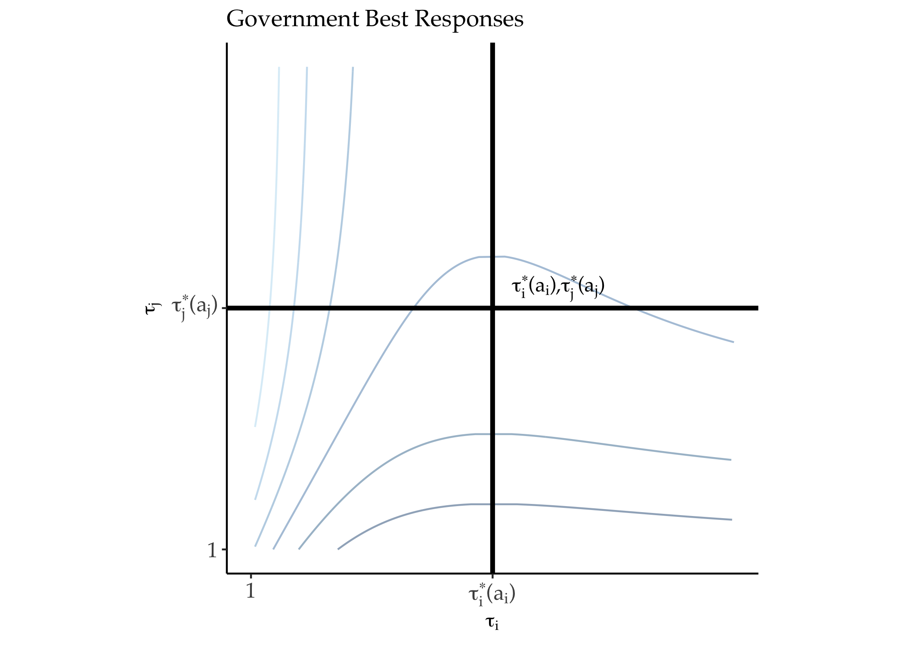
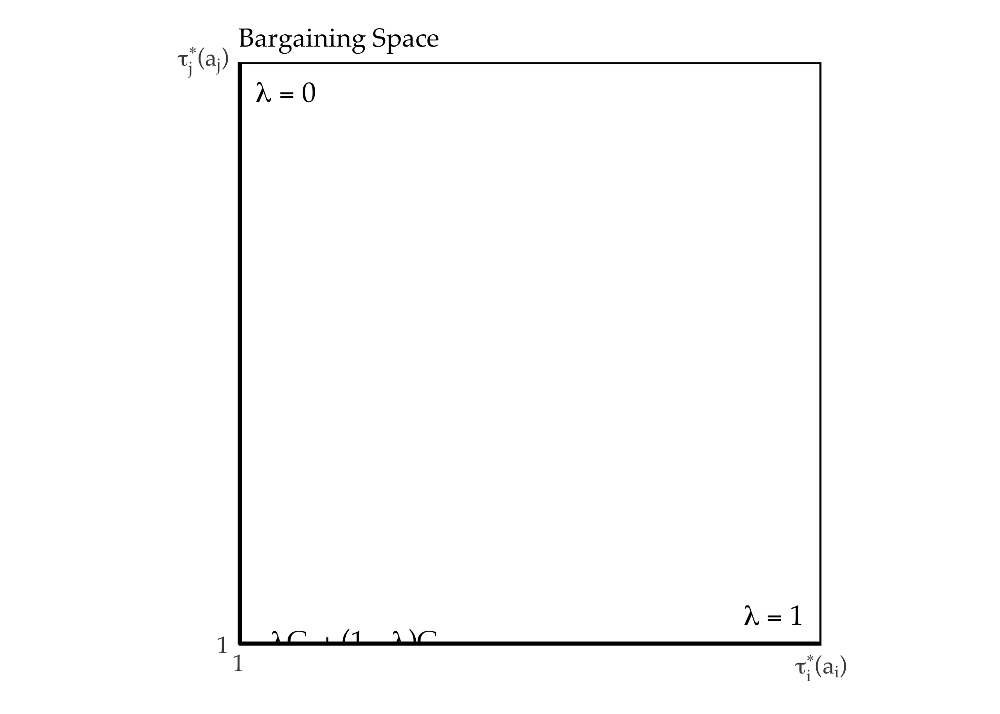

\newpage

# Introduction

<!-- ---
bibliography: /Users/bcooley/Dropbox/References/library.bib
biblio-style: apsr
suppress-bibliography: true
--- -->

Countries with deep trading relationships rarely fight wars with one another. Some argue this "commercial peace" is due to the pacifying effect of trade — trade causes peace.^[This literature is vast. See @Gartzke2015 for a complete survey. @Angell1911, @Polachek1980, and @Philippe2008 are representative of this view.] Others say amicable political relations cause trade.^[See, for example, @Pollins1989a, @Barbieri1999, @Benson2007] Trade is usually considered exogenous to conflicts of interest in international relations. Governments fight wars over territorial, ideological, or other non-economic conflicts. Trade intervenes to make these conflicts more costly.

Yet, trade policy is itself a central object of contention in international relations. Governments are mercantilist to some extent [@Gawande2009]. They desire some degree of protection at home and "open doors" abroad. Sometimes, governments are willing to fight wars to achieve these objectives.^[See @Findlay2007 for a chronicle of trade conflicts over the past millennium.] In the 1850s, the U.S. gunboats compelled an autarkic Japanese government to open its markets. Britain and France prosecuted the Opium Wars (1839-1842; 1856-1860) to compel a recalcitrant Chinese government to reform its trade policies. Recently, a proposal to integrate the economies of Ukraine and the European Union led to war between Ukraine and Russia.^[In this case, Moscow conditioned its coercion on the trade policy choices of Kiev, see James Marson and Naftali Bendavid, ["Ukraine to Delay Part of EU Pact Opposed by Russia,"]([https://www.wsj.com/articles/poroshenko-says-eu-agreement-to-be-ratified-next-week-1410519009](https://www.wsj.com/articles/poroshenko-says-eu-agreement-to-be-ratified-next-week-1410519009)) *The Wall Street Journal*, 12 September 2014.] These episodes highlight linkages between trade policy and war. But such linkages may be more common, as the absence of war need not imply the absence of coercive bargaining [@Fearon1995].

Here, I develop a theory of trade policy bargaining in the shadow of military power, or "gunboat diplomacy." Trade flows and the probability of peace are positively correlated in equilibrium. This correlation emerges not because trade causes peace. Rather, liberal trade policy preferences generate incentives for both trade and peace. When peace prevails, latent military threats influence equilibrium trade policies. These balance domestic political-economic interests against military threats from abroad. Militarily weak countries are more open to trade than powerful ones, all else equal.

The model considers the interaction between two governments (home and foreign). The governments value consumers' welfare, firms' profits, and tariff revenue. These components of government utility depend on an underlying "new trade" international economy [@Krugman1980; @Venables1987]. Governments differ in how much influence consumers have over policymaking.^[This setup mirrors @Grossman1994.] I refer to this variation as the governments' degree of political *bias*.^[This phraseology borrows from @Jackson2007. In their model, political bias determines the extent to which the pivotal decision maker internalizes the costs of war. Conceptually, bias is similar to the size of the selectorate in the model of @BuenodeMesquita2003.] Tariffs help firms by shielding them from competition, but raise prices for consumers. *Low bias* or *liberal* governments prefer lower tariffs.

Governments care about trade policy choices abroad because of market access externalities [@Ossa2011; @Ossa2012]. Firms' profits depend on their ability to access foreign markets. High tariffs shift profits from foreign to home firms. Therefore, firms on opposite sides of a border experience a conflict of interest over trade policy. Firms desire protection at home and liberalization abroad. The greater their bias, the more the governments internalize these interests.

As a consequence, governments themselves experience conflicts of interest over trade policy. The magnitudes of these conflicts of interest vary as a function of the governments' bias. When governments value consumer welfare, they prefer to adopt low barriers to trade. In doing so, they impose small market access externalities on their trading partners. Governments' relations are harmonious when they both hold liberal trade policy preferences. There is no incentive for conflict, militarized or otherwise. As governments become less liberal, conflicts of interest become more severe.

If a government wins a war, it earns the right to impose regime change and install a "puppet" government abroad.^[See @Owen2002 for an empirical study of regime change.] Puppets open their markets to foreign firms, allowing victorious governments impose their trade policy preferences by force. This is the threat point governments leverage in bilateral trade policy negotiations. War sometimes occurs due to information frictions.

Two primary insights emerge from this environment. First, governments' degree of bias affects their propensity to trade and fight wars. When both governments are liberal, they find little reason to overthrow their counterpart. This decreases the probability of war. Their liberal preferences also result in liberal equilibrium trade policies. Lowering barriers to trade increases trade itself. It is the governments' preference compatibility that produces a relationship between trade and peace. But this relationship is spurious — trade itself has no pacifying effect.

Second, even when governments avoid conflict, trade policies reflect the balance of power. Powerful countries can credibly threaten to impose regime change. They leverage this power to extract trade policy concessions and resist liberalization. After bargaining, powerful countries are more protectionist than weaker ones.

The model also rationalizes several well-established empirical facts in international relations. Bilateral trade tends to decrease before wars and rebound thereafter.^[This relationship is shown in Figure \ref{fig:tradeRD} in the Appendix.] In the model, protectionist preference shocks decrease trade, but also increase the likelihood of war. As a consequence, periods of depressed trade correlate with war onset. Conversely, regime change following war causes a liberal preference shock to the losing country's government. Trade increases after wars, as in the data.

Some argue democracies have more liberal trade policy preferences than autocracies [@Milner2005]. Because consumers (voters) prefer free trade, they punish protectionist politicians [@Mayer1984; @Grossman1996].^[For a skeptical take on this mechanism, see @Guisinger2009 and @Betz2019.] This provides a check on the protectionist influence of special interest groups. Translated into this framework, these theories deem democracies less biased than autocracies. If this "liberal democracy" hypothesis is true, the analysis of low bias governments extends to democratic dyads. The model then jointly rationalizes the democratic peace and democracies' propensity for trade openness.^[These facts are depicted in Figure \ref{fig:comdempeace} in the Appendix. For a recent review on the relationship between democracy and peace, see @Reiter2017. @Milner2005 show democratization tends to lead to decreased protectionism.]

The theory's expectations about power and protectionism are, as far as I know, novel. Of course, power and latent preferences interact to produce trade policy and conflict outcomes. An unconditional correlation may not uncover this relationship. I consider these empirical implications in more detail in the Discussion section. There, I also relate the theory to militarism, imperialism, and territorial conflict.

@Antras2011 and @Carroll2018 are two closely related papers that merit some discussion. @Antras2011 consider a similar model, in which foreign governments can interfere in the domestic political economy of trade. As in this model, foreign influence has a liberalizing effect. In the anarchy of world politics, however such influence can always -– in principle -– take the form of threats, displays, or uses of military force [@Fearon1997]. Analyzing this form of influence allows me to relate the domestic political economy of trade to military power and conflict propensity. @Carroll2018 unifies militarized competition and economic exchange in a more general setting. There, countries' convert commodities into military power, which can in turn be employed to seize others' commodities. Military power is endogenous to the general equilibrium of the international economy. I take power as exogenous and focus on competition over trade *policy*. This more narrow focus allows me to incorporate domestic political economy considerations and make empirical predictions about power, trade policy, and war.

# Environment

Here and in the Analysis section, I relegate proofs and derivations of key quantities to the Appendix, in order to ease exposition. I first present the context in which governments bargain, followed by the international economy. The general equilibrium of the economy deternubes how trade policies affect prices, wages, and trade flows and the welfare of consumers, firms, and the governments that represent them. Proposition `` 1 ``, presented in this section, states that given our assumptions, an *economic equilibrium* (Definition `` 2 ``) will exist for any trade policy choices. Lemma `` 1 `` states that within this environment, government preferences over their own trade policies are well-behaved and admit interior optima.

## International Bargaining

Two governments, home ($i$) and foreign ($j$) bargain over their joint trade policies $\bm{\tau} = \left\{ \tau_i, \tau_j \right\} \in [1, \bar{\tau}]^2$.^[Here, $\bar{\tau}$ is an aribitrary prohibitively high tariff that shuts down bilateral trade.] By controlling the degree of market access afforded to foreign firms, governments' trade policies impose externalities on one another. Government utility can therefore be written $G_i( \bm{\tau} | a_i)$.^[I develop the international economy from the home country's perspective, but analagous primitives exist for the foreign country.] Government preferences depend on an exogenous parameter $a_i \in [0, \bar{a}]$, which controls the value these governments place on consumer welfare, relative to firm profits and tariff reveune.^[$\bar{a}$ is defined below.] Higher tariffs increase firm profits by shifting market share to local firms. This comes at the expense of consumers, however, who benefit from having access to a variety of products, home and foreign. Higher tariffs also harm foreign firms and the foreign government. This is the model's core conflict of interest. Each government would like to implement some degree of protectionism at home, while maintaining access to markets abroad. 

Bargaining occurs in the shadow of power. Government $i$ makes a take-it-or-leave-it offer $\tilde{\bm{\tau}} = \left\{ \tilde{\tau}_i, \tilde{\tau}_j \right\}$ to Government $j$. Government $j$ can either accept the offer or declare war, a choice denoted with $\omega \in \left\{ \text{accept}, \text{war} \right\}$. This is a simple coercive bargaining framework following @Fearon1995. Here, however, war results in *regime change*, rather than a simple costly division of a fixed surplus. Regime change is modeled as a change in a vanquished government's *preferences*. If government $i$ wins a war, it replaces the government of its counterpart, fixing its preference parameter at $\tilde{a}_j$. $\rho$ denotes the probability that Government $i$ is successful in a war for regime change.^[With complementary probability, the initiating government is overthrown. An more realistic formulation might allow for the possibility that no regime change occurs, with $\rho_i + \rho_j \leq 1$. While this "all or nothing" conception of war is stark, it simplifies the analysis and highlights the forces at play.] $c_i$ is the cost that government $i$ must pay if a war occurs. $c_j$ is held as private information. Government $i$ believes $c_j$ is distributed according to $F$ where $F$ is the uniform c.d.f. on $[0, \bar{c}_j]$.

As is standard in bargaining models of war, the costs of war must be bounded, or the proposing country will never risk conflict. Assumption `` 1 `` formalizes this intuition. 

**Assumption 1:** 
$c_i < \kappa$ where $\kappa$ is a postive constant defined in the Appendix.

A strategy for Government $i$ is an offer, $\tilde{\bm{\tau}}(a_i, c_i, \rho)$. A strategy for Government $j$, denoted $\omega(\tilde{\bm{\tau}}; a_j, c_j, \rho)$ is a mapping between this offer and a choice of whether or not to attempt regime change
$$
\omega : \tilde{\bm{\tau}} \rightarrow \left\{ \text{accept}, \text{war} \right\}
$$
Let $\tilde{G}(\tilde{\bm{\tau}}, \omega | a_k, c_k, \rho)$ denote government $k$'s utility as a function of these choice. From these objects we can define a bargaining equilibrium which is subgame perfect. 

**Definition 1:** 
A subgame perfect *bargaining equilibrium* is pair of strategies, $\tilde{\bm{\tau}}^\star(a_i, c_i)$ and $\omega^\star(\tilde{\bm{\tau}}; a_j, c_j)$ such that
$$
\omega^\star(\tilde{\bm{\tau}}; a_j, c_j, \rho) = \argmax_{\omega \in \left\{\text{accept}, \text{war} \right\}} \tilde{G} \left(\tilde{\bm{\tau}}, \omega; a_j, c_j; \rho \right)
$$
and
$$
\tilde{\bm{\tau}}^\star(a_i, c_i, \rho) \in \argmax_{\bm{\tau} \in [1, \bar{\tau}]^2} \mathbb{E}_{f(c_j)} \left[ \tilde{G} \left(\tilde{\bm{\tau}}, \omega^\star(\tilde{\bm{\tau}}; a_j, c_j, \rho); a_i, c_i; \rho \right) \right]
$$

## International Economy

Government preferences in the game described above depend on the mechanics of the international economy. To simply the presentation and focus on the dynamics of coercive bargaining in this political economy, I consider the special case in which countries are mirror images of one another in terms of their economic primitives. Each country is inhabited by a representative consumer with labor endowment $L_i = L_j = L$. Consumers value varieties of manufactured goods and goods from an undifferentiated outside sector, which I'll call agriculture. By providing their labor to local producers of these goods, they earn an endogenous wage $w_i$. A unit of labor can produce one unit of both differentiated goods and agricultural goods. There are $n_i = n_j = n$ firms in each economy which produce differentiated manufactured goods.^[In a completely general equilibrium, this quantity would also be an endogenous object. Fixing the number of firms allows each firm to derive positive profits, providing biased governments with an incentive to implement a positive tariff. In this sense, the model is in a "short run" equilibrium in which profits have not yet been competed away. I assume that $n$ is large enough such that firms take the price index $P_i$ as given when choosing prices.] Agricultural goods are produced competitively. The setup borrows from @Venables1987 and @Ossa2012. 

### Tariffs and Prices

Firms engage in monopolistic competition, setting prices in each market to maximize profits, given the preferences of consumers. Governments can shift the prices that consumers pay for foreign goods by charging a uniform import tariff on manufactured goods, $\tau_i - 1$. This drives a wedge between the price set by foreign firms, $p_j$, and the price paid by consumers for foreign goods, $p_{ij} = \tau_i p_j$. The price in the agricultural sector serves as the numeraire, $p_i^y = 1$. The government collects the revenue raised from tariffs.

### Consumption

Consumer preferences over agricultural goods $Y_i$ and aggregated differentiated varieties $X_i$ are Cobb-Douglas, where an exogenous parameter $\alpha \in [0,1]$ controls the consumers' relative preference for differentiated varieties. Consumers therefore solve the following problem
\begin{equation} \label{eq:cMax}
\begin{split}
\max_{X_i, Y_i} & \quad X_i^\alpha Y_i^{1 - \alpha} \\
\text{subject to} & \quad P_i X_i + Y_i \leq w_i L
\end{split}
\end{equation}
where $X_i$ is a CES aggregate of manufactured goods $x$, a la @Dixit1977. Consumers value each differentiated good equally. Home and foreign goods are distinguished only by their price. Let $x_{ij}$ denote the quantity of differentiated goods produced in country $j$ that are consumed in country $i$. This gives
\begin{equation} \label{eq:CES}
X_i = \left( n x_{ii}^{\frac{\sigma - 1}{\sigma}} + n x_{ij}^{\frac{\sigma - 1}{\sigma}} \right)^{\frac{\sigma}{\sigma - 1}}
\end{equation}
where $\sigma > 1$ is the elasticity of substitution between varieties. The aggregate price level of differentiated goods in each country is described by the CES exact price index
\begin{equation} \label{eq:P}
P_i = \left( n p_{ii}^{1-\sigma} + n p_{ij}^{1-\sigma} \right)^{\frac{1}{1 - \sigma}}
\end{equation}

Equilibrium demand for manufactured goods from $j$ in $i$ is
\begin{equation} \label{eq:demand}
x_{ij}^\star(p_{ij}) = p_{ij}^{-\sigma} P_i^{\sigma - 1} \alpha w_i L
\end{equation}

Indirect utility over manufactured goods is
\begin{equation} \label{eq:V}
V_i^x(P_i) = \frac{\alpha w_i L}{P_i}
\end{equation}

### Production

Firms set prices to maximize profits across home and foreign markets, given consumer demand. Because all firms in country $i$ face the same demand curves at home and abroad, they all set the same price. The quantity that each firm $i$ produces for market $j$ is equal to the demand for $i$'s goods in $j$, $x_{ij}^\star$. The firms' problem is given by
\begin{equation} \label{eq:Pi}
\begin{split}
\max_{p_i} & \quad \Pi_i(p_i) = \left( p_i - w_i \right) \left( x_{ii}^\star(p_i) + x_{ji}^\star(p_i) \right) \\
\text{subject to} & \quad x_{ii}^\star(p_i) = p_i^{-\sigma} P_i^{\sigma - 1} \alpha w_i L \\
& \quad x_{ji}^\star(p_i) = (\tau_j p_i)^{-\sigma} P_j^{\sigma - 1} \alpha w_j L
\end{split}
\end{equation}

This problem yields equilibrium prices
\begin{equation} \label{eq:prices}
p_i^\star = \frac{\sigma}{\sigma - 1} w_i
\end{equation}

Equilibrium profits can then be computed as $\Pi_i(p_i^\star)$
\begin{equation} \label{eq:PiStar}
\Pi_i(p_i^\star) = n \left( \frac{1}{\sigma - 1} w_i \right) \left( x_{ii}^\star(p_i^\star) + x_{ji}^\star(\tau_j p_i^\star) \right)
\end{equation}

By raising the price of foreign varieties, tariffs shift profits from foreign to home producers. As tariffs get large ($\tau_j \rightarrow \bar{\tau}$), demand for foreign manufactured goods contracts ($x_{ji}^\star(\tau_j p_i^\star) \rightarrow 0$). Consumers substitute toward home varieties ($p_j^\star x_{jj}^\star(p_j^\star) \rightarrow \alpha w_j L$), increasing local profits. While consumers are harmed by the imposition of tariffs ($\frac{\partial V_j}{\partial \tau_j} < 0$), local producers benefit. The preferences of home consumers are aligned with those of *foreign* firms, both of which desire liberal trade policies from the home government. 

I assume that firms' welfare is dependent only on their profits, and not influenced by the aggregate price level ($P_i$) within the economy. This is consistent with the special case of @Grossman1994 in which firm owners are "small" in the broader population. A more complex preference structure would emerge if this assumption were violated, or if firms employed intermediate goods in production.

### Economic Equilibrium

Consumers lend their labor endowment to the manufacturing and agricultural sectors in order to maximize their income. If both sectors are active, then wages must equalize across sectors, $w_i^x = w_i^y = w_i$.^[More specifically, because agricultural goods serve as the numeraire, $w_i = 1$.] Let $L_i^x$ denote the amount of labor $i$ allocates toward manufacturing and $L_i^y$ the amount of labor $i$ allocates toward agriculture.

**Definition 2:** 
An *economic equilibrium* is pair of wages $\left\{w_i, w_j \right\}$ such that international agricultural and manufacturing markets clear
\begin{equation*}
\begin{split}
L_i^y + L_j^y = (1 - \alpha) \left( w_i L + w_j L \right) \\
L_i^x = n \left( x_{ii}^\star(p_i^\star) + x_{ji}^\star(\tau_j p_i^\star) \right) \\
L_j^x = n \left( x_{ij}^\star(\tau_i p_j^\star) + x_{jj}^\star(p_j^\star) \right) \\
L_i^x + L_j^x + \Pi_i(p_i^\star) + \Pi_j(p_j^\star) = \alpha \left( w_i L + w_j L \right)
\end{split}
\end{equation*}
and domestic factor markets clear
\begin{equation*}
\begin{split}
L_i^x + L_i^y = L \\
L_j^x + L_j^y = L
\end{split}
\end{equation*}

There is a natural conflict of interest between consumers and producers within the economy. Producers prefer higher prices and consumers prefer lower prices. If the agricultural sector is active, it pins down wages and nullifies incentives for governments to employ tariffs for purposes of manipulating the terms of trade. Assumption 2 guarantees that the agricultural sector will remain active regardless of the governments' choices of trade policies. Substantively, it requires that consumers spend a large enough proportion of their income on agricultural goods to prevent the specialization of either country in the production of manufactured goods. This allows me to focus analysis on profit shifting incentives for trade policy, as in @Ossa2012.

**Assumption 2:** 
$$
\alpha < \frac{2}{3} \frac{\sigma}{\sigma - 1}
$$ 

**Proposition 1:** 
If Assumption 2 is satisfied, then a unique economic equilibrium exists with $L_i^x, L_i^y, L_j^x, L_j^y > 0$ and $w_i = w_j = 1$ for all $\left\{ \tau_i, \tau_j \right\} \in [1, \bar{\tau}]^2$.

### Tariff Revenue

For every unit of manufactured goods imported, the government collects $(\tau_{i} - 1) p$ in tariff revenue. Unlike typical theories of optimal taxation in public economics [@Dixit1985], these revenues are not returned to the pockets of consumers. This assumption allows for a range of potential government uses for tariff revenue. Tariff revenue can in principle be devoted to any government expenditure. Liberal governments might redistribute it to the population and derive welfare from this redistribution, while illiberal governments might spend it on rennovations to presidential palaces. Regardless the manner in which it is spent, governments value this revenue equally. Total tariff revenue can be written
\begin{equation} \label{eq:revenue}
r_i(\tau_i) = n (\tau_i - 1) p_j x_{ij}^\star(\tau_i p_j)
\end{equation}

### Government Preferences

Governments value a combination of consumer welfare, producer profits, and tariff revenue.^[Goverments value only the component of consumer welfare derived from the consumption of manufactured goods. With Cobb-Douglas utility and constant returns to scale technology in the agricultural sector, consumers will derive a constant utility from their consumption of agricultural goods $V_i^y$. Thus, total consumer indirect utility $V_i$ is equal to $V_i^x$ up to a constant.] With these quantities derived, we can write
\begin{equation} \label{eq:G}
G_i(\tau_i, \tau_j | a_i) = a_i V_i^x(\tau_i) + \Pi_i(\tau_i, \tau_j) + r_i(\tau_i)
\end{equation}

The exogenous parameter $a_i > 0$ controls the relative weight the government places on consumer welfare, relative to profits and revenue. This conception of government preferences follows @Grossman1994, in which $a_i$ represents the value the government places on campaign contributions relative to consumer welfare.^[In their model, firms lobby for protective tariffs (or export subsidies), promising campaign contributions in exchange for policy deviations from the consumer welfare-maximizing ideal. @Grossman1996 provide additional microfoundations for this objective function in a model of electoral competition, in which the government can employ campaign contributions to influence the vote choice of "uneducated" voters.]

I take $a_i$ as a measure of the representativeness of $i$'s government. When $a_i$ is small (high bias), the government privileges the narrow interests of firms and its own revenue. As $a_i$ gets larger (low bias), the welfare of consumers plays a larger role in determining the governments' preferences. If democracies are more sensitive to the interests of consumers, then we would expect them to have higher values of $a_i$ than autocracies.

I focus the analysis on the interesting case in which these mixed motives cause the government to prefer some degree of protection. Assumption `` 3 `` guarantees that the government would adopt a positive tariff in a world in which coercive bargaining did not occur. This requires that the government's weight on consumer welfare be sufficiently small.^[Even in today's relatively open international economy, it is rare to observe governments dismantling all barriers to trade. Those governments that adopt low tariff barriers often substitute with higher non-tariff barriers to trade. See @Kono2006.]

**Assumption 3:** 
$a_i \in (0, \bar{a})$ with
$$
\bar{a} = (2n)^{\frac{1}{1-\sigma}} \left( \frac{\sigma}{\sigma - 1} + \frac{1}{2} \right)
$$

In this model, the number of firms, $n$ is given exogenously. This contrasts with standard models of international trade in which a zero profit condition disciplines the number of firms any country can support [@Krugman1980]. For this reason, $\bar{a}$ depends on $n$. As $n$ gets large, the consumer benefits from the availability of more varieties of manufactured goods -- $\bar{a}$ must fall in order to compensate for this artificial positive shock to indirect utility.

**Lemma 1:** 
If Assumption 3 is satisfied, then $G_i(\tau_i; a_i)$ is quasiconcave on $\tau_i \in \left[ 1, \bar{\tau} \right]$.

# Analysis

Recall from Definition `` 1 `` that a bargaining equilibrium is a trade policy offer from the home country, and a decision of whether or not to declare war, given this offer, from the foreign country. This section analyzes how these equilibrium choices vary as a function of the governments' bias types.

The results can be summarized as follows. Because they internalize the welfare of consumers, liberal governments prefer to adopt lower tariffs (Lemma `` 2 ``). If governments were unable to bargain, a non-cooperative equilibrium (Definition `` 3 ``) would emerge in which governments simply implemented their ideal tariffs. This non-cooperative equilibrium serves as a baseline from which governments compare offers in a bargaining equilibrium (Definition `` 1 ``). As governments' degree of bias increases, they impose larger and larger externalities on one another in a non-cooperative equilibrium. This increases the degree of conflict of interest between the governments (Definition `` 4 ``), and makes regime change relatively more appealing. Governments with higher bias experience larger conflicts of interest with one another (Proposition `` 3 ``) which makes them more likely to experience wars (Proposition `` 4 ``). Because they prefer lower trade barriers, liberal governments also trade more in any bargaining equilibrium (Proposition `` 5 ``).

## Preferences

Figure \ref{fig:G} depicts the governments' objective functions as a function of their own tariff choice, $\tau_i$. As the government becomes more representative, the peak of the curve shifts to the left, indicating that the government prefers a lower tariff. This is a natural result. As the government becomes more representative, it values the welfare of the consumer more and more. This pushes the government to adopt a policy that is closer to the consumer's ideal. 

Figure \ref{fig:iso} depicts the government's welfare in $\left\{ \tau_i, \tau_j \right\}$ space. By decreasing the market access afforded to firms in $i$, non-zero tariffs in $j$ strictly decrease the government's welfare. For any given $\tau_i$, the government's welfare is increasing as $\tau_j$ decreases.

**Lemma 2:** 
$G_i(\tau_j)$ is strictly decreasing in $\tau_j$.

If the governments were prohibited from bargaining, they would each simply choose the policy that maximized their utility, taking the other country's policy choice as given. Their best response functions are
$$
\tau_i(a_i, \tau_j) = \argmax_{\tau_i \in [1, \bar{\tau}]} G_i(\tau_i, \tau_j; a_i)
$$
and
$$
\tau_j(a_j, \tau_i) = \argmax_{\tau_j \in [1, \bar{\tau}]} G_j(\tau_i, \tau_j; a_j)
$$

**Definition 3:** 
A *noncooperative equilibrium* is a pair of policies $\left\{ \tau_i^\star(a_i), \tau_j^\star(a_j) \right\}$ such that 
$$
\tau_i^\star(a_i) = \tau_i(a_i, \tau_j^\star(a_j))
$$
and
$$
\tau_j^\star(a_j) = \tau_j(a_j, \tau_i^\star(a_i))
$$

**Lemma 3:** 
$\tau_i^\star(a_i)$ is decreasing in $a_i \in (0, \bar{a})$ with $\tau_i^\star(\bar{a}) = 1$.

Figure \ref{fig:br} depicts each governments' best response curves through the policy space. Because the governments' optimal choices do not depend on one another's policy choice, their best response curves are straight lines. Their intersection constitutes the noncooperative equilibrium. As the governments preferences become more biased, these curves shift outward, resulting in a more autarkic noncooperative equilibrium.

## Regime Change

It is clear that each government cares indirectly about the preferences of its bargaining partner. More welfare-concious governments adopt lower barriers to trade (Lemma 3) in a non-cooperative equilibrium, which benefits governments abroad by providing greater market access to their firms. If each government were able to choose the preferences of their negotiating partner, they would do so in order to minimize trade barriers. This is the purpose of regime change in this model. If a government wins a war, it earns the right to replace the government with a puppet with more "dovish" preferences. Regime change is therefore used instrumentally to pry open international markets. Let $a^\star \in (0, \bar{a}]$ denote the type of the optimal puppet government.

The optimal puppet's type solves
$$
\max_{a \in (0, \bar{a}]} G_i( \tau_i^\star(a_i), \tau_j^\star(a_j); a_i )
$$

**Proposition 2:** 
$a^\star = \bar{a}$

If a government wins a war, it will replace the vanquished government with a maximimally-responsive puppet. This government will adopt no trade barriers, providing maximal market access for the victorious country's firms. This is the threat point that governments leverage in international coercive bargaining.

## Conflicts of Interest

If a government wins a war it adopts its optimal policy and enjoys complete access to the markets of its trading partner. This best case scenario yields the government utility
\begin{equation*} \label{eq:Gbar}
\bar{G}_i(a_i) = G_i(\tau_i^\star(a_i), \tau_j^\star(a^\star); a_i ) = G_i(\tau_i^\star(a_i), 1; a_i)
\end{equation*}

If a government loses a war, it is replaced by a puppet and must suffer under the policies implemented by the puppet regime. This is consistent with a notion of the government as a particular amalgamation of social actors that continues to exist at the conclusion of a war. The vanquished government yields utility
\begin{equation*} \label{eq:Gubar}
\ubar{G}_i(a_i, a_j) = G_i(\tau_i^\star(a^\star), \tau_j^\star(a_j); a_i) = G_i(1, \tau_j^\star(a_j); a_i)
\end{equation*}

These outcomes represent upper and lower utility bounds on the outcome of any coercive negotiation. Each government can be made no worse off than if it were to lose a war. And each government can secure no better bargaining outcome than if they were to (costlessly) win a war for regime change. The welfare difference between these two scenarios is taken to be $i$'s *conflict of interest* with $j$. Note that this conflict of interest, unlike standard models of bargaining and war, need not be symmetric. The "pie" at stake in the negotiation over trade policies may be valued differently by each government –- $i$’s preference intensity may be stronger than $j$’s or vice versa. This variation in preference intensity, combined with variable military power, determines bargaining outcomes.

**Definition 4:** 
The magnitude of government $i$'s *conflict of interest* with government $j$ is 
\begin{equation} \label{eq:Gamma}
\Gamma_i(a_i, a_j) = \bar{G}_i(a_i) - \ubar{G}_i(a_i, a_j)
\end{equation}

**Proposition 3:** 
$\Gamma_i(a_i, a_j)$ is decreasing in $a_i$, $a_j$

Proposition 3 states that as government $i$ becomes more welfare-concious, the magnitude of its conflict of interest decreases. Likewise, as government $j$ becomes more welfare-concious, $i$'s conflict of interest with it decreases. As government $i$ becomes more welfare-concious, it prefers less protectionism. This decreases the difference between $i$'s ideal policy and the (free trading) policy that will be imposed upon it if $j$ is victorious in a war. As $j$ becomes more welfare-concious, it imposes smaller market access externalities on $i$. Regime change becomes relatively less appealing, because the distance between $j$'s preferred policy and the policy that a puppet would impose shrinks. In the corner case where $a_i = a_j = \bar{a}$, the conflict of interest evaporates -- puppets would implement the exact same policies as the sitting governments. 

## Bargaining

These conflicts of interest structure what sets of policies $i$ will offer and what offers $j$ will prefer to war. Working backward, recall from Definition 1 that $\omega^\star(\tilde{\bm{\tau}}; a_j, c_j, \rho)$ is a function that takes an offer from $i$ and returns a choice of whether or not to declare war. $j$'s utility for war is given by
\begin{equation*} \label{eq:Ghatj}
\hat{G}_j(a_j, a_i) = \underbrace{(1 - \rho) \bar{G}_j(a_j) + \rho \ubar{G}_j(a_j, a_i)}_{\zeta_j(a_j, a_i)} - c_j = (1 - \rho) \Gamma_j(a_j, a_i) + \ubar{G}_j(a_j, a_i) - c_j
\end{equation*}

Note that $j$'s utility can be written in terms of it's conflict of interest with $i$. $j$ will prefer war to $i$'s offer whenever
$$
\hat{G}_j(a_j, a_i) \geq G_j(\tilde{\bm{\tau}}; a_j)
$$
This condition allows us to characterize $\omega^\star(\tilde{\bm{\tau}}; a_j, c_j, \rho)$.

**Lemma 4:** 
$$
\omega^\star(\tilde{\bm{\tau}}; a_j, c_j; \rho) = \begin{cases}
\text{war} & \text{if } \hat{G}_j(a_j, a_i) \geq G_j(\tilde{\bm{\tau}}; a_j) \\
\text{accept} & \text{otherwise}
\end{cases}
$$

Then, with uniformly distributed costs, the probability that $j$ will declare war is
\begin{equation} \label{eq:prwar}
\begin{split}
\text{Pr} \left\{ c_j \leq \zeta_j(a_j, a_i) - G_j(\tilde{\bm{\tau}}; a_j) | \tilde{\bm{\tau}}, a_i, a_j \right\} = F \left( \zeta_j(a_j, a_i) - G_j(\tilde{\bm{\tau}}; a_j)  \right)
\end{split}
\end{equation}

With this quantity known, we can work to characterize $i$'s offer function, $\tilde{\bm{\tau}}^\star(a_i)$. If war occurs, $i$ receives utility
\begin{equation*} \label{eq:Ghati}
\hat{G}_i(a_i, a_j) = \rho \Gamma_i(a_i, a_j) + \ubar{G}_i(a_i, a_j) - c_i
\end{equation*}

With the probability of war given in Equation \ref{eq:prwar}, we can write $i$'s utility for any offer as
\begin{equation} \label{eq:Gtildei}
\begin{split}
\tilde{G}_i \left( \tilde{\bm{\tau}}, \omega^\star(\tilde{\bm{\tau}}; a_j, c_j, \rho); a_i, c_i, \rho \right) = \underbrace{\left( 1 - F \left( \zeta_j(a_j, a_i) - G_j( \tilde{\bm{\tau}}; a_j ) \right) \right) \left( G_i( \tilde{\bm{\tau}}; a_i ) \right)}_{\neg \text{war}} + \\
\underbrace{F \left( \zeta_j(a_j, a_i) - G_j(\tilde{\bm{\tau}}; a_j) \right) \left( \hat{G}_i(a_i, a_j) \right)}_{\text{war}} 
\end{split}
\end{equation}

By Definition 1, $i$'s equilibrium offer will maximize this objective function. Lemmas `` 5 `` and `` 6 `` state that an offer will lie inside the pareto set and that proposed trade policies will be weakly more liberal than those in a noncooperative equilibrium (Definition 3).

**Definition 5:** 
The *pareto set* is given by
$$
\mathcal{P} = \left\{ \tilde{\bm{\tau}} \in [1, \bar{\tau}]^2 | \tilde{\bm{\tau}} \in \argmax_{\tilde{\bm{\tau}} \in [1, \bar{\tau}]^2} \lambda G_i(\tilde{\bm{\tau}}; a_i) + (1 - \lambda) G_j(\tilde{\bm{\tau}}; a_j) \right\}
$$
for some $\lambda \in [0, 1]$.

**Lemma 5:** 
$\tilde{\bm{\tau}}^\star(a_i, c_i, \rho) \in \mathcal{P}$

**Lemma 6:** 
$\tilde{\bm{\tau}} = \left\{ \tilde{\tau}_i^\star, \tilde{\tau}_j^\star \right\} \leqslant \left\{ \tau_i^\star(a_i, c_i, \rho), \tau_j^\star(a_i, c_i, \rho) \right\}$

The bargaining enviroment is depicted in Figure \ref{fig:bar}. Government $i$'s ideal point lies in the bottom right corner of the bargaining space, in which $j$ opens its markets completely and $i$ implements $\tau_i^\star(a_i, c_i, \rho)$. Government $j$'s ideal point, conversely, lies in the top left corner. By Lemma 5, $i$'s offer will lie along the dark line connecting these ideal points. Government $i$'s utility is strictly decreasing as it moves along the pareto set toward $j$'s ideal point.^[This observation follows from Lemmas 1 and 2.] However, the closer $i$'s offer is to it's ideal point, the more likely $j$ is to declare war. Thus, government $i$ confronts a classic risk-return trade-off [@Powell1999].

Here, however, the severity of this tradeoff depends on the magnitude of $i$'s conflict of interest with $j$. If $i$ and $j$ are maximially welfare concious, they both adopt free trade, obviating the need for any bargaining at all. As $i$ and $j$ become more kleptocratic, the stakes of the negotiation increase. As Proposition `` 4 `` formalizes, this increases the likelihood of war.

**Proposition 4:** 
In a bargaining equilibrium (Definition 1), the probability of war is weakly decreasing in $a_i$ and $a_j$.

Conditional on peace, the policy outcomes of the bargaining equilibrium become more liberal as the governments become less biased. This increases trade between the governments.

**Proposition 5:** 
In a peaceful bargaining equilibrium (Definition 1), trade is weakly increasing in $a_i$ and $a_j$.

In peaceful outcomes, military power affects trade policy. More specifically, as $i$ becomes more powerful, it adopts higher barriers to trade.

**Proposition 6:** 
$\tilde{\tau}_i^\star(a_i, c_i, \rho)$ is increasing in $\rho$.

# Discussion

Propositions 4 and 5 establish that governments that trade intensely experience fewer wars. Trade policy determines trade flows and generates conflicts between governments. Economic integration is not exogenously given. Participation in the international economy is a choice. Trade policy generates large trade frictions, even in today's globalized era [@Anderson2004].

These policy choices are the object of contention between governments. Protectionist barriers cause conflicts of interest between market access-motivated governments. @Mcdonald2004 shows that measures of protection are better predictors of conflict than trade.^[His analysis covers the years 1960-2000.] Trade can persist in the presence of trade barriers. For example, World War I broke out during an era of rapid globalization. @Mcdonald2007 show that the great powers maintained high protective tariffs during this era. These tariffs provided a rationale for conflict over market access conditions, despite high trade volumes. @Chatagnier2015 examine governments whose firms compete in the same export markets. They show these governments are more likely to experience international conflicts.

Firms are the source of belligerent foreign policies in the theory. In Imperial Germany, "iron and rye" advocated for protectionism and expansionist foreign policies [@Gerschenkron1943]. Similar domestic political coalitions emerged in the United States. @Fordham2019 traces the development of the United States as a naval power in the 19th century. He finds protectionist interests were the strongest advocates for the nascent U.S. fleet. At the time, U.S. trade policy was protectionist. Washington also sought preferential market access in developing countries, particularly in Latin America. The fleet served to protect these objectives against military interference from Europe. Commercial objectives also motivated Washington at the dawn of the Cold War [@Fordham1998]. Under Soviet influence, Eastern Europe became closed to trade with the United States. Congressmen representing export-oriented districts tended to support an aggressive military posture toward the Soviet Union. The goal of export-oriented firms, argues Fordham, was to secure market access in Europe and Japan. In the post-Cold War era, Congressmen representing import-exposed districts have tended to support hostile foreign policies toward China, whose exports (plausibly) harm their constituent firms [@Kleinberg2013]. 

Domestic political institutions connect these underlying economic interests to government preferences. I treat these institutions in reduced form, focusing on variation in consumers' ability to influence policy. Consumers pacify foreign policy preferences. If democratic political institutions privilege the interests of consumers, then Propositions 4 and 5 support a commercial-democratic peace. Observational analyses uncover positive correlations between democracy, trade, and peace because of the trade policy preferences of democracies.^[See @Oneal1999 for a representative study.] Liberal preferences increase trade and reduce conflict.

Observed trade policies are not a sufficient statistic for government preferences, however. Proposition 6 states that relative military power effects trade policy in peacetime. Governments' trade policies reflect their preferences only up to a war constraint. Liberal *policies* do not imply liberal *preferences*. Several studies have employed @Grossman1994 and @Grossman1995 to structurally estimate governments' welfare-consciousness [@Goldberg1999; @Mitra2006; @Gawande2009; @Gawande2012; @Ossa2014; @Gawande2015]. International strategic considerations are effectively absent from these models. The domestic political economy determines outcomes. Therefore, a simple inversion on the policy function recovers preferences. My model highlights the importance of the war constraint. Militarily weak, illiberal governments adopt the same policies as liberal governments.

Territory plays a central role in theories and empirical studies of interstate conflict.^[The "pie" at stake in bargaining models of war is often motivated as the distribution of territory between the countries. Empirical studies of territorial conflict often conceptualize territorial control as a consumption good, rather than a means to implement policy. See, for example, @Caselli2015. For a review of this literature, see @Schultz2015.] Wars often redraw international borders. In doing so, they also relocate customs barriers and modify the trade policies of captured regions. Gunboat diplomacy and territorial conflict are plausibly substitutes for one another. Governments can acquire foreign market access through territorial annexation or regime change. Territory and trade policy are not exclusive realms of international conflict.

# Conclusion

The model envisions a stylized world. Two governments preside over identical economies exogenous military capacities and political bias types. If the countries were heterogeneous in market size ($L_i$), the economically larger country would possess an additional source of bargaining power. Whether this outside option affects bargaining outcomes would depend on the distribution of economic and military strength. This analysis might shed light the substitutability of economic and military coercion [@Hirschman1945].

Military power ($\rho$) is also treated as exogenous here. If military investment was possible, $\rho$ would depend on economic and political primitives.^[See, for example, @Jackson2009.] Because they have more at stake in bargaining, illiberal governments might invest more in their militaries. This results would hold especially if the costs of militarization are borne by consumers [@Jackson2007; @Chapman2015]. This variant might explain why democracies spend less on their militaries [@Fordham2005].

If the game developed here was dynamic, regime type itself would be an endogenous object. Wars impose puppet governments more liberal than those that preceded them. The world would democratize over time, as conquering powers installed liberal governments abroad. [@Mcdonald2015].

While imperial powers sometimes seek to democratize defeated countries, they often instead install allied strongmen or colonial administrations. If the liberal democracy hypothesis holds, these actions are puzzling. Controlling these governments presents agency problem absent in relations with liberal regimes. Liberal regimes adopt liberal trade policies of their own accord. Conquerers must incentivize their agents to adopt these policies.

A multi-country variant of this framework might provide a rationale for this behavior. Consider a world populated with three countries — A, B, and C. For firms in A, an ideal policy for B is one that is open to trade with A but closed to trade from C. This allows A's firms to maximize their share of B's market.^[This assumes, of course, that B cannot tax its own firms.] In other words, firms seek *preferential* access to foreign markets. It is immediate that a low bias government would not provide such preferential access. Coercing governments might be willing to suffer the agency costs of obtaining preferential access to B if B's market was valuable enough. This framework might be profitably applied to the study of imperialism [@Gallagher1953].

Finally, the theory highlights an underappreciated prerequisite for international conflict. For governments to war with one another, they must both 1) possess conflicts of interest large enough to justify the costs of conflict and 2) be unable to resolve these conflicts peacefully [@Jackson2009b]. Theoretical research on international conflict has focused on the latter. In abstracting away from the exact nature of the dispute at hand, these models direct our attention away from the question of why international disputes emerge in the first place. What do governments want, and why do their objectives bring them into conflict with one another [@Moravcsik1997; @CoeND]? While war is rare in international politics, antagonistic and militarized political relations are common. Focusing attention on the conflicts of interest underlying these antagonisms might help explain their emergence and termination.

\clearpage

# Appendix

## Trade, War, and Democracy: Empirical Facts

\clearpage

## International Economy

**Demand for Manufactured Goods:** Total expenditure on manufactured goods is $\alpha w_i L = P_i X_i$. Cobb Douglas preferences ensure that consumers will spend an $\alpha$-share of their income on manufactured goods. We can derive Equation \ref{eq:demand} by solving Equation \ref{eq:CES} subject to the constraint
\begin{equation} \label{eq:CESconstraint}
p_{i1} x_{i1} + p_{i2} x_{i2} \leq \alpha w_i L
\end{equation} 
This gives
$$
x_{i1} = \left( \frac{p_{i2}}{p_{i1}} \right)^{\sigma} x_{i2}
$$
Substituting back into \ref{eq:CESconstraint} gives
\begin{align*}
n p_{i1} \left( \frac{p_{i2}}{p_{i1}} \right)^{\sigma} x_{i2} + n p_{i2} x_{i2} &= \alpha w_i L \\
n p{i1}^{1-\sigma} p_{i2}^{\sigma} x_{i2} + n p_{i2} x_{i2} & = \alpha w_i L \\
x_{i2} p_{i2}^{\sigma} \left( n p_{i1}^{1-\sigma} + n p_{i2}^{1-\sigma} \right) &= \alpha w_i L \\
x_{i2} p_{i2}^{\sigma} P_i^{1 - \sigma} &= \alpha w_i L \\
x_{i2}^\star(p_{i2}) &= p_{i2}^{-\sigma} P_i^{\sigma - 1} \alpha w_i L
\end{align*}
An equivalent demand condition can be derived for $x_{i1}^\star(p_{i1})$.

**Indirect Utility:** Indirect utility over manfactured good is $X_i$ evaluated at equilibrium consumption. Substituting our demand equations \ref{eq:demand} into Equation \ref{eq:CES} gives
\begin{align*}
V_i^x(P_i) = X_i^\star &= \left( n \left( p_{i1}^{-\sigma} P_i^{\sigma - 1} \alpha w_i L \right)^{\frac{\sigma - 1}{\sigma}} + n \left( p_{i2}^{-\sigma} P_i^{\sigma - 1} \alpha w_i L \right)^{\frac{\sigma - 1}{\sigma}} \right)^{\frac{\sigma}{\sigma - 1}} \\
&= \left( \left( \alpha w_i L P_i^{\sigma - 1} \right)^{\frac{\sigma - 1}{\sigma}} \left( n \left( p_{i1}^{-\sigma} \right)^{\frac{\sigma - 1}{\sigma}} + n \left( p_{i2}^{-\sigma} \right)^{\frac{\sigma - 1}{\sigma}} \right) \right)^{\frac{\sigma}{\sigma - 1}} \\
&= \alpha w_i L P_i^{\sigma - 1} \left( n p_{i1}^{1 - \sigma} + n p_{i2}^{1 - \sigma} \right)^{\frac{\sigma} \sigma - 1} \\
&= \alpha w_i L P_i^{\sigma - 1} P_i^{-\sigma} \\
&= \frac{\alpha w_i L}{P_i}
\end{align*}
Note that expenditure on manufactured goods can now be written in terms of the price index. $\alpha w_i L = P_i X_i^\star$. 

**Prices:** The firms' first order condition is
$$
\frac{\partial \Pi(p_i)}{\partial p_i} = \left( p_i - w_i \right) \left( \frac{\partial x_{ii}(p_i)}{\partial p_i} + \frac{\partial x_{ji}(p_i)}{\partial p_i} \right) + x_{ii}(p_i) + x_{ji}(p_i) = 0
$$
where
$$
\frac{\partial x_{ii}(p_i)}{\partial p_i} = - \sigma p_i^{- \sigma - 1} P_i^{\sigma - 1} \alpha w_i L
$$
and
$$
\frac{\partial x_{ji}(p_i)}{\partial p_i} = - \sigma \tau_j^{-\sigma} p_i^{- \sigma - 1} P_j^{\sigma - 1} \alpha w_j L
$$
Note that 
$$
- \frac{\sigma}{p_i} \left( x_{ii}(p_i) + x_{ji}(p_i) \right) = \frac{\partial x_{ii}(p_i)}{\partial p_i} + \frac{\partial x_{ji}(p_i)}{\partial p_i}
$$
The first order condition then becomes
\begin{align*}
\sigma \frac{w_i}{p_i} \left( x_{ii}(p_i) + x_{ji}(p_i) \right) - \sigma \left( x_{ii}(p_i) + x_{ji}(p_i) \right) + \left( x_{ii}(p_i) + x_{ji}(p_i) \right) &= 0 \\
\sigma \frac{w_i}{p_i} - \sigma + 1 &= 0 \\
p_i^\star &= \frac{\sigma}{\sigma - 1} w_i
\end{align*}

## Proofs

**Proposition 1:** 
Let $q_i^y$ denote the quantity of the agricultural good produced in country $i$. A competitive agricultural sector guarantees that agricultural producers make zero profits. This zero profit condition implies
\begin{align*}
\left( p_i^y - w_i \right) q_i^y &= 0 \\
\left( 1 - w_i \right) q_i^y &= 0
\end{align*}
which implies $w_i = 1$ whenever the agricultural sector is active, $q_i^y > 0$. From Equation \ref{eq:prices}, this implies $p_i = p_j = p = \frac{\sigma}{\sigma - 1}$. Suppose for now that the agricultural sector is active in both countries, implying wages are equalized across countries and sectors. Below, we verify that this is the case if Assumption 2 is satisfied. 

Labor allocations to each sector depend on tariff levels. The labor allocation in country $i$ to sector $k \in \left\{ x, y \right\}$ can then be written $L_i^k(\tau_i, \tau_j)$. Total allocation to the manufacturing sector can be written
$$
L_i^x(\tau_i, \tau_j) = n \left( x_{ii}^\star(\tau_i) + x_{ji}^\star(\tau_j) \right)
$$
Because $x_{ii}^\star(\tau_i)$ is increasing in $\tau_i$ and $x_{ji}^\star(\tau_j)$ is decreasing in $\tau_j$, $L_i^x(\tau_i, \tau_j)$ is increasing in $\tau_i$ and decreasing in $\tau_j$. This implies $L_i^x(\tau_i, \tau_j)$ attains its maximum at $\left\{ \bar{\tau}, 1 \right\}$
\begin{align*}
L_i^x(\bar{\tau}, 1) &= n \left( p^{-\sigma} P_i(\bar{\tau})^{\sigma - 1} \alpha L + p^{-\sigma} P_j(1)^{\sigma - 1} \alpha L \right) \\
&= n \left( \frac{p^{-\sigma} \alpha L}{n p^{1 - \sigma}} + \frac{p^{-\sigma} \alpha L}{2 n p^{1 - \sigma}} \right) \\
&= \left( \frac{\alpha L}{p} + \frac{1}{2} \frac{\alpha L}{p} \right) \\
&= \frac{3}{2} \frac{\sigma - 1}{\sigma} \alpha L
\end{align*}
Allocation to the agricultural sector is then, by the labor market clearing condition, 
$$
L_i^y(\bar{\tau}, 1) = L - L_i^x((\bar{\tau}, 1))
$$
If $\alpha < \frac{2}{3} \frac{\sigma}{\sigma - 1}$, then $L_i^y(\bar{\tau}, 1) > 0$. Because total labor allocation to the manufacturing sector achieves its maximum at $\left\{ \bar{\tau}, 1 \right\}$, $L_i^y(\tau_i, \tau_j) > 0$ for all $\left\{ \tau_i, \tau_j \right\} \in [1, \bar{\tau}]^2$. $\blacksquare$

**Lemma 1:** 
For $G_i(\tau_i)$ to be quasiconcave, its first derivative must have a single root with 
$$
\frac{\partial G_i(\tau_i, \tau_j)}{\partial \tau_i}(1) > 0
$$
and
$$
\lim_{\tau_i \rightarrow \infty} \frac{\partial G_i(\tau_i, \tau_j)}{\partial \tau_i} < 0
$$
Note that given symmetry across countries, price indices can be written 
$$
P_i(\tau_i) = \left( n p^{1 - \sigma} + n (\tau_i p)^{1 - \sigma} \right)^{\frac{1}{1 - \sigma}} = p n^{\frac{1}{1 - \sigma}} \left( 1 + \tau_i^{1 - \sigma} \right)^{\frac{1}{1 - \sigma}}
$$
$G_i(\tau_i, \tau_j)$ can be simplified as follows
\begin{align*}
G_i(\tau_i, \tau_j) &= a_i V_i^x(\tau_i) + \Pi_i(\tau_i, \tau_j) + r(\tau_i) \\
&= a_i \frac{\alpha L}{P_i(\tau_i)} + n (p - 1) \left( x_{ii}^\star(p) + x_{ji}^\star(\tau_j p) \right) + n p (\tau_i - 1) x_{ij}^\star(\tau_i p) \\
&= \alpha L \left[ \frac{a_i}{P_i(\tau_i)} + n p^{1 - \sigma} P_i(\tau_i)^{\sigma - 1} - n p^{-\sigma} P_i(\tau_i)^{\sigma - 1} + n p^{1 - \sigma} P_j(\tau_j)^{\sigma - 1} - n p^{-\sigma} P_j(\tau_j)^{\sigma - 1} + \right. \\
& \bigl. n (\tau_i p)^{1 - \sigma} P_i(\tau_i)^{\sigma - 1} - n \tau_i^{-\sigma} p^{1 - \sigma} P_i(\tau_i)^{\sigma - 1} \biggr] \\
&= \alpha L \left[ \frac{a_i}{P_i(\tau_i)} + n ( p^{1 - \sigma} - p^{-\sigma} ) P_j(\tau_j)^{\sigma - 1} + n ( p^{1 - \sigma} - p^{- \sigma} ) P_i(\tau_i)^{\sigma - 1} \left( 1 + \tau_i^{1 - \sigma} - \tau_i^{-\sigma} \right) \right] \\
&= \alpha L \left[ a_i n^{\frac{1}{\sigma - 1}} p^{-1} \left( 1 + \tau_i^{1 - \sigma} \right)^{\frac{1}{\sigma - 1}} + ( 1 - p^{-1} ) \left( 1 + \tau_j^{1 - \sigma} \right)^{-1} + \right. \\
& \bigl. \left( 1 + \tau_i^{1 - \sigma} \right)^{-1} \left( 1 - p^{-1} + \tau_i^{1 - \sigma}  - \tau_i^{-\sigma} \right) \biggr] \\
&= \alpha L \left[ a_i n^{\frac{1}{\sigma - 1}} p^{-1} \left( 1 + \tau_i^{1 - \sigma} \right)^{\frac{1}{\sigma - 1}} + ( 1 - p^{-1} ) \left( 1 + \tau_j^{1 - \sigma} \right)^{-1} + 1 - ( \tau_i^{-\sigma} + p^{-1} ) \left( 1 + \tau_i^{1 - \sigma} \right)^{-1} \right]
\end{align*}

The first derivative is then
\begin{equation*}
\begin{split}
\frac{\partial G_i(\tau_i, \tau_j)}{\partial \tau_i} = \alpha L \left[ - a_i p^{-1} n^{\frac{1}{\sigma - 1}} \left( 1 + \tau_i^{1 - \sigma} \right)^{\frac{1}{\sigma - 1} - 1} \tau_i^{-\sigma} + \sigma \tau_i^{-\sigma - 1} \left( 1 + \tau_i^{1 - \sigma} \right)^{-1} + \right. \\
\left. \left( 1 + \tau_i^{1 - \sigma} \right)^{-2} \tau_i^{-\sigma} (1 - \sigma) ( \tau_i^{-\sigma} + p^{-1} ) \right]
\end{split}
\end{equation*}

At any root, we must have
\begin{align*}
0 &= \frac{\partial G_i(\tau_i, \tau_j)}{\partial \tau_i}  \\
&= \alpha L \left[ - a_i p^{-1} n^{\frac{1}{\sigma - 1}} \left( 1 + \tau_i^{1 - \sigma} \right)^{\frac{1}{\sigma - 1} - 1} \tau_i^{-\sigma} + \sigma \tau_i^{-\sigma - 1} \left( 1 + \tau_i^{1 - \sigma} \right)^{-1} + \right. \\
& \bigl. \left( 1 + \tau_i^{1 - \sigma} \right)^{-2} \tau_i^{-\sigma} (1 - \sigma) ( \tau_i^{-\sigma} + p^{-1} ) \biggr] \\
&= \alpha L \left[ - a_i p^{-1} n^{\frac{1}{\sigma - 1}} \left( 1 + \tau_i^{1 - \sigma} \right)^{\frac{1}{\sigma - 1}} + \sigma \tau_i^{- 1} + \left( 1 + \tau_i^{1 - \sigma} \right)^{-1} (1 - \sigma) ( \tau_i^{-\sigma} + p^{-1} ) \right]
\end{align*}

From this condition it is straightforward to verify that if $a_i < \bar{a}$, then as $\tau_i \rightarrow 1$,
$$
\frac{\partial G_i(\tau_i, \tau_j)}{\partial \tau_i} \rightarrow - a_i p^{-1} (2n)^{\frac{1}{\sigma - 1}} + \sigma + \frac{1}{2} (1 - \sigma) (1 + p^{-1}) > 0
$$
As $\tau_i \rightarrow \infty$, 
$$
\frac{\partial G_i(\tau_i, \tau_j)}{\partial \tau_i} \rightarrow - a_i n^{\frac{1}{\sigma - 1}} p^{-1} + (1 - \sigma) p^{-1} < 0
$$
Since $\frac{\partial G_i(\tau_i, \tau_j)}{\partial \tau_i}$ is a continuous function, it must therefore have at least one root, by the intermediate value theorem. To see that this root is unique, note that the first order condition can be rearranged as follows
$$
\underbrace{a_i n^{\frac{1}{\sigma - 1}} p^{-1} \tau_i}_{\phi(\tau_i; a_i)} = \underbrace{\left( \sigma + \tau_i^{1 - \sigma} + \tau_i p^{-1} ( 1 - \sigma) \right) \left( 1 + \tau_i^{1-\sigma} \right)^{\frac{\sigma}{1 - \sigma}}}_{\psi(\tau_i)}
$$
Note that $\phi(1; a_i) < \psi(1)$ for all $a_i < \bar{a}$. Additionally, $\phi(\tau_i; a_i)$ is a linear function and $\psi(\tau_i)$ is a concave function with
$$
\lim_{\tau_i \rightarrow \infty} \psi(\tau_i) = \sigma
$$
Together these facts imply that the intersection $\frac{\partial G_i(\tau_i, \tau_j)}{\partial \tau_i} = 0$ is unique. $\blacksquare$

**Lemma 2:** 
It is sufficient to show that 
$$
\frac{\partial G_i(\tau_j)}{\partial \tau_{j}} < 0
$$
Here we have
\begin{align*}
\frac{ \partial G_i(\tau_j) }{ \partial \tau_j } &= n (p - 1) \frac{ \partial x_{ji}^\star(p \tau_j) }{ \partial \tau_j } \\
&= \tau_j^{-\sigma - 1} \left( 1 + \tau_j^{1 - \sigma} \right)^{-1} \left( \frac{\sigma - 1}{\sigma} \right) \alpha L \underbrace{\left( \frac{\sigma - 1}{\tau_j^{\sigma - 1} + 1} - \sigma \right)}_{<0}
\end{align*}

**Lemma 3:** 
Government $i$'s optimal policy does not depend on the policy choice of $j$. As such, it is sufficient to show that the government's objective function has a negative cross partial with respect to $\tau_i$, $a_i$,
$$
\frac{\partial^2 G_i}{\partial a_i \partial \tau_{ij}} < 0
$$
Here we have
\begin{align*}
\frac{\partial^2 G_i}{\partial a_i \partial \tau_{ij}} &= - \frac{\sigma - 1}{\sigma} n^{\frac{1}{\sigma - 1}} \left( 1 + \tau_i^{1 - \sigma} \right)^{\frac{1}{\sigma - 1} - 1} \tau_i^{- \sigma} \alpha L
\end{align*}
To see that $\tau_i^\star(\bar{a}) = 1$, we can show that the first order condition evaluated at $\tau_i = 1$ equals zero when $a_i = \bar{a}$. From above, the first order condition evaluated at $\tau_i = 1$ is
$$
0 = - a_i p^{-1} (2n)^{\frac{1}{\sigma - 1}} + \sigma + \frac{1}{2} (1 - \sigma) (1 + p^{-1})
$$
Substituting $\bar{a}$ confirms that $\tau_i^\star(\bar{a}) = 1$. $\blacksquare$

**Proposition 2:** 
Follows immediately from Lemma 2 and Lemma 3 $\blacksquare$

**Proposition 3:** 
To establish that $\Gamma_i(a_i, a_j)$ is decreasing in $a_i$, note that derivative of $\Gamma_i(a_i, a_j)$ taken with respect to $a_i$ is
\begin{align*}
\frac{\partial \Gamma_i(a_i, a_j)}{\partial a_i} &= \left. \frac{\partial G_i(\tau_i^\star(a_i), 1; a_i)}{\partial a_i} \right|_{\left\{ \tau_i^\star(a_i), 1 \right\}} + \underbrace{\frac{\partial G_i(\tau_i^\star(a_i), 1; a_i)}{\partial \tau_i^\star(a_i)}}_{=0} \frac{\partial \tau_i^\star(a_i)}{\partial a_i} - \left. \frac{\partial G_i(1, \tau_j^\star(a_j); a_i)}{\partial a_i} \right|_{\left\{ 1, \tau_j^\star(a_j) \right\}} \\
&= \underbrace{V_i^x(P_i(\tau_i^\star(a_i))) - V_i^x(P_i(1))}_{<0}
\end{align*}
where the final inequality holds because $\tau_i^\star(a_i) > 1$ for all $a_i < \bar{a}$. To see that $\Gamma_i(a_i, a_j)$ is decreasing in $a_j$, note
\begin{align*}
\frac{\partial \Gamma_i(a_i, a_j)}{\partial a_j} &= - \underbrace{\frac{\partial G_i(1, \tau_j^\star(a_j); a_i)}{\partial \tau_j^\star(a_j)}}_{<0} \underbrace{\frac{\partial \tau_j^\star(a_j)}{\partial a_j}}_{<0}
\end{align*}
where the inequalities follow from Lemma 2 and Lemma 3. $\blacksquare$

**Lemma 5:** 
Suppose $\tilde{\bm{\tau}}^\star(a_i) \notin \mathcal{P}$. It is straightforward to show that this produces a contradiction, namely
$$
\tilde{\bm{\tau}}^\star(a_i, c_i, \rho) \notin \argmax_{\tilde{\bm{\tau}} \in [1, \bar{\tau}^2]} \tilde{G}_i \left( \tilde{\bm{\tau}}, \omega^\star(\tilde{\bm{\tau}}; a_j, c_j, \rho); a_i, c_i, \rho \right)
$$

First, if $\tilde{\bm{\tau}}^\star \notin \mathcal{P}$, then there exists $\tilde{\bm{\tau}}^\prime \in [1, \bar{\tau}]^2$ such that either 1) $G_i(\tilde{\bm{\tau}}^\prime) > G_i(\tilde{\bm{\tau}}^\star)$ and $G_j(\tilde{\bm{\tau}}^\prime) \geq G_j(\tilde{\bm{\tau}}^\star)$ or 2) $G_j(\tilde{\bm{\tau}}^\prime) > G_j(\tilde{\bm{\tau}}^\star)$ and $G_i(\tilde{\bm{\tau}}^\prime) \geq G_i(\tilde{\bm{\tau}}^\star)$. 

Take the first case and recall
\begin{equation*}
\begin{split}
\tilde{G}_i \left( \tilde{\bm{\tau}}, \omega^\star(\tilde{\bm{\tau}}; a_j, c_j, \rho); a_i, c_i, \rho \right) = \left( 1 - F \left( \zeta_j(a_j, a_i) - G_j( \tilde{\bm{\tau}}; a_j ) \right) \right) \left( G_i( \tilde{\bm{\tau}}; a_i ) \right) + \\
F \left( \zeta_j(a_j, a_i) - G_j(\tilde{\bm{\tau}}; a_j) \right) \left( \hat{G}_i(a_i, a_j) \right) 
\end{split}
\end{equation*}

In the proof of Lemma P4A (below), I show $G_i(\tilde{\bm{\tau}}^\star) > \zeta_i(a_i, a_j) \geq \hat{G}_i(a_i, a_j)$. Also, $F(\tilde{\bm{\tau}}^\star) \leq F(\tilde{\bm{\tau}}^\prime)$. Then, if 1) or 2), then $\tilde{G}_i \left( \tilde{\bm{\tau}}^\prime, \omega^\star(\tilde{\bm{\tau}}; a_j, c_j, \rho) | a_i, c_i, \rho \right) > \tilde{G}_i \left( \tilde{\bm{\tau}}^\star, \omega^\star(\tilde{\bm{\tau}}; a_j, c_j, \rho); a_i, c_i, \rho \right)$, producing the desired contradicition.

**Lemma 6:** 
Suppose, for sake of contradiction, that for some $\tilde{\bm{\tau}}^\star$, $\tilde{\tau}_i^\star > \tau_i^\star(a_i)$. By Lemma 5, $\tilde{\bm{\tau}}^\star$ must lie in the pareto set. By the definition of $\tau_i^\star(a_i)$, $G_i(\tilde{\tau}_i^\star, \cdot; a_i) < G_i(\tau_i^\star(a_i), \cdot; a_i)$. By Lemma 2, $G_j(\cdot, \tilde{\tau}_i^\star; a_j) < G_j(\cdot, \tau_i^\star(a_i); a_i)$. Thus, a pareto improvement exists, contradicting the hypothesis that $\tilde{\bm{\tau}}^\star$ is an equilibrium offer. $\blacksquare$

**Proposition 4:** 
At this point I invoke Assumption 1, so I define the upper bound on $c_i$.
\begin{equation} \label{eq:kappa}
\kappa = \min_{\tau_i \in \mathcal{P}_i} - \bar{c} \left( 1 - F \left( \zeta_j(0, 0) - G_j(\cdot, \tilde{\tau}_i; 0) \right) \right) \frac{ \frac{\partial G_i(\tau_i, \cdot; 0)}{\partial \tau_i} }{ \frac{\partial G_j(\cdot, \tau_i; 0)}{\partial \tau_i} }
\end{equation}

Because $\frac{\partial G_j(\cdot, \tau_i; 0)}{\partial \tau_i}$ is negative, $\kappa > 0$. 

The proof proceeds through a series of lemmas. Let $\hat{\bm{\tau}}$ solve 
$$
G_i(\hat{\bm{\tau}}) = \zeta_i(a_i, a_j) = \rho \bar{G}_i(a_i) + (1 - \rho) \ubar{G}_i(a_i, a_j)
$$
subject to $\hat{\bm{\tau}} \in \mathcal{P}$. If no feasible solution exists, then let $\hat{\bm{\tau}} = \left\{ 1, \tau_j^\star(a_j) \right\}$. Note that for all $\tau_i \in \mathcal{P}$, 
$$
\frac{\partial G_i(\tilde{\tau}_i)}{\partial \tau_i} > 0
$$

**Lemma P4A:** $\hat{\tau}_i < \tilde{\tau}_i^\star$

**Proof:** From the first order condition of Equation \ref{eq:Gtildei}, we have
$$
\frac{\partial \tilde{G}_i(\tilde{\tau}_i)}{\partial \tilde{\tau}_i} = \left( 1 - F \left( \zeta_j(a_j, a_i) - G_j(\cdot, \tilde{\tau}_i | a_j) \right) \right) \frac{\partial G_i(\tilde{\tau}_i)}{\partial \tau_i} + \frac{1}{\bar{c}} \frac{\partial G_j(\tilde{\tau}_i)}{\partial \tilde{\tau}_i} \left( G_i(\tilde{\tau}_i) - \hat{G}_i(a_i, a_j) \right) = 0
$$
Rearranging,
\begin{align*}
\left( 1 - F \left( \zeta_j(a_j, a_i) - G_j(\cdot, \tilde{\tau}_i; a_j) \right) \right) \frac{\partial G_i(\tilde{\tau}_i)}{\partial \tau_i} &= \frac{1}{\bar{c}} \frac{\partial G_j(\tilde{\tau}_i)}{\partial \tilde{\tau}_i} \left( \hat{G}_i(a_i, a_j) - G_i(\tilde{\tau}_i) \right) \\
\left( 1 - F \left( \zeta_j(a_j, a_i) - G_j(\cdot, \tilde{\tau}_i; a_j) \right) \right) \frac{\partial G_i(\tilde{\tau}_i)}{\partial \tau_i} &= \frac{1}{\bar{c}} \frac{\partial G_j(\tilde{\tau}_i)}{\partial \tilde{\tau}_i} \left( \zeta_i(a_i, a_j) - c_i - G_i(\tilde{\tau}_i) \right) \\
\left( 1 - F \left( \zeta_j(a_j, a_i) - G_j(\cdot, \tilde{\tau}_i; a_j) \right) \right) \frac{\partial G_i(\tilde{\tau}_i)}{\partial \tau_i} + \frac{c_i}{\bar{c}} \frac{\partial G_j(\tilde{\tau}_i)}{\partial \tilde{\tau}_i} &= \frac{1}{\bar{c}} \frac{\partial G_j(\tilde{\tau}_i)}{\partial \tilde{\tau}_i} \left( \zeta_i(a_i, a_j) - G_i(\tilde{\tau}_i) \right)
\end{align*}

If Assumption 1 is satisfied, then the left-hand side of this equation is negative. Then, for this equality to hold, we must have
$$
\zeta_i(a_i, a_j) - G_i(\tilde{\tau}_i) < 0 \implies G_i(\tilde{\tau}_i) > \zeta_i(a_i, a_j) = G_i(\hat{\tau}_i)
$$
which in turn implies the Lemma. $\blacksquare$

**Lemma P4B:** $\tilde{\tau}_i^\star(a_i)$ is decreasing in $a_i$ and $\tilde{\tau}_j^\star(a_i)$ is increasing in $a_i$.

**Proof:** It is sufficient to show that $\tilde{G}_i(\tilde{\tau}_i)$ has negative cross partial in $a_i$. 
$$
\frac{\partial^2 \tilde{G}_i(\tilde{\tau}_i)}{\partial \tilde{\tau}_i \partial a_i} < 0
$$
From the characteristics of the Pareto set, it is immediate that if $\tilde{\tau}_i^\star(a_i)$ is decreasing in $a_i$, then $\tilde{\tau}_j^\star(a_i)$ is increasing in $\tau_i$, $a_i$. We have
\begin{align*}
\frac{\partial^2 \tilde{G}_i(\tilde{\tau}_i)}{\partial \tilde{\tau}_i \partial a_i} &= \left( 1 - F(\cdot) \right) \underbrace{\frac{\partial^2 G_i(\tilde{\tau}_i)}{\partial \tilde{\tau}_i \partial a_i}}_{<0} - \frac{1}{\bar{c}} \underbrace{\frac{\partial \hat{G}_j(a_j, a_i)}{\partial a_i}}_{>0} \underbrace{\frac{\partial G_i(\tilde{\tau}_i)}{\partial \tilde{\tau}_i}}_{>0} + \frac{1}{\bar{c}} \underbrace{\frac{\partial G_j(\tilde{\tau}_i)}{\partial \tilde{\tau}_i}}_{<0} \underbrace{\left( \frac{\partial G_i(\tilde{\tau}_i)}{\partial a_i} - \frac{\partial \hat{G}_i(a_i, a_j)}{\partial a_i} \right)}_{=\phi(\tilde{\tau}_i)}
\end{align*}
where
$$
\phi(\tilde{\tau}_i) = V_i^x(\tilde{\tau}_i) - \underbrace{\left( \rho V_i^x(\tau_i^\star(a_i)) + (1 - \rho) V_i^x(1) \right)}_{=V(\hat{\tau}_i)}
$$
Because $V_i^x$ is a decreasing function of $\tau_i$ and $\hat{\tau}_i < \tilde{\tau}_i^\star$, $\phi(\tilde{\tau}_i) < 0$, confirming that $\tilde{G}_i(\tilde{\tau}_i)$ has negative cross partial in $\tau_i$, $a_i$. This confirms $\tilde{\tau}_i^\star(a_i)$ is weakly decreasing in $a_i$. By the definition of the pareto set, we must have $\tilde{\tau}_j^\star(a_i)$ is weakly increasing in $a_i$. $\blacksquare$

The equilibrium probability of war is
$$
F \left( \zeta_j(a_j, a_i) - G_j(\tilde{\tau}_j^\star(a_i), \tilde{\tau}_i^\star(a_i); a_j) \right)
$$
Because $G_j$ is increasing in $\tau_j \in \mathcal{P}_j$, $\tau_j^\star(a_i)$ is increasing in $a_i$, and $F(\cdot)$ is an increasing function, the probability of war is decreasing in $a_i$. A similar proof confirms that the equilibrium probability of war is decreasing in $a_j$. $\blacksquare$

**Proposition 5:** 
Equilibrium trade in manufactured goods is 
$$
x_{ij}^\star(\tau_i) + x_{ji}^\star(\tau_j)
$$
where both $x_{ij}^\star(\tau_i)$ and $x_{ji}^\star(\tau_j)$ are decreasing in each country's tariff rate. The bounds of the pareto set are decreasing in $a_i$, $a_j$ by Lemma 3. Otherwise, the strategic situation is unchanged from that analyzed in the proof of Proposition 4. Thus, $\tilde{\tau}_i^\star(a_i)$ and $\tilde{\tau}_j^\star(a_i)$ are weakly decreasing in $a_i$. Thus, equilibrium trade is also increasing. $\blacksquare$ 

**Proposition 6:** 
Note first that 
$$
\frac{\partial \zeta_j}{\partial \rho} = \underline{G}_j - \bar{G}_j < 0
$$
and
$$
\frac{\partial \hat{G}_i}{\partial \rho} = \Gamma_i > 0
$$
We have
$$
\frac{\partial^2 \tilde{G}_i(\tilde{\tau}_i)}{\partial \tilde{\tau}_i \partial \rho} = - \frac{1}{\bar{c}} \underbrace{\frac{\partial G_i(\tilde{\tau}_i)}{\partial \tilde{\tau}_i}}_{>0} \underbrace{\frac{\partial \zeta_j}{\partial \rho}}_{<0} - \frac{1}{\bar{c}} \underbrace{\frac{\partial G_j(\tilde{\tau}_i)}{\partial \tilde{\tau}_i}}_{<0} \underbrace{\frac{\partial \hat{G}_i}{\partial \rho}}_{>0} > 0
$$
which implies
$$
\frac{\partial \tilde{\tau}_i^\star(a_i)}{\partial \rho} > 0
$$
as desired. $\blacksquare$ 

\clearpage

# References

